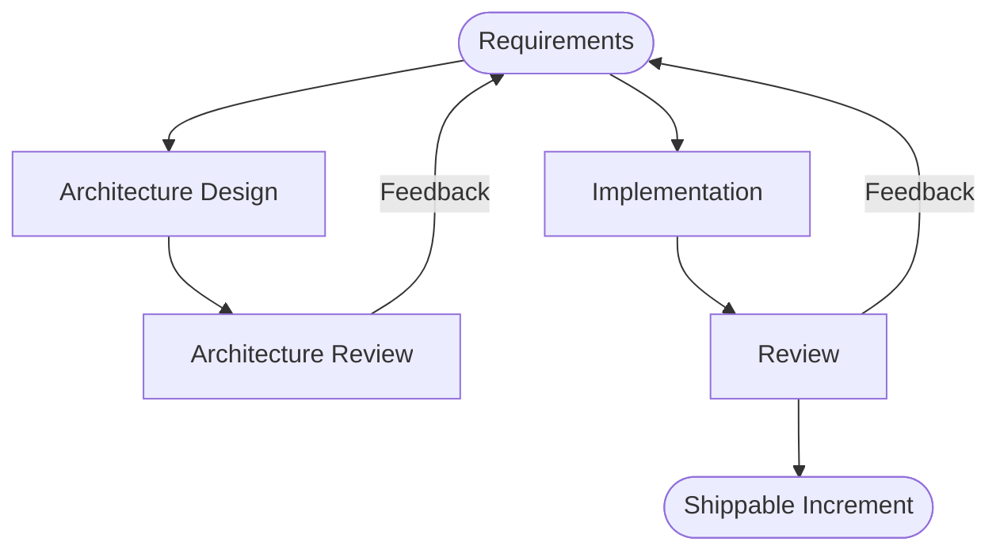

# Correct Procedure...

Iterative changeis important. We don't know what the system will look like in the beginning.

One example for iterative change is Scrum. 

Architecture development process is 

Requirements change over the process and needs priorisation. Review of the requirements can change requirements.

## When is architecture needed?

* Decisions can only be changed hardly
* Implementation or change is expensive
* high Requirements
* implementation only hard in existing solution
* own experience is minimal

> "You should pay as much attention to software architecture as it contributes risk to the overall project, since if there is little architecture risk, then optimizing it only helps little."
>
> — George Fairbanks

In the first iteration of the architecture flow the following should be done:

* Understanding goals and vision
* System context 
* Collect architecture risks
* Identify quality problems\

In following iterations

* Systemcontext updated
* Risiken and relevant information verified and updated
* Collect and descirbe scnearios
* Collect Development requirements 
