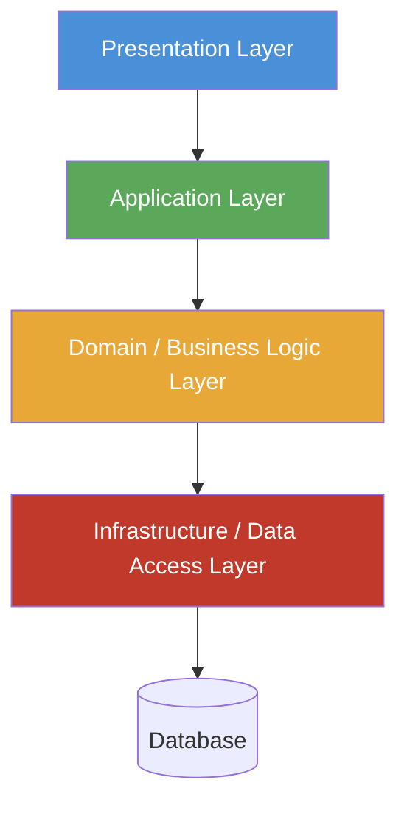
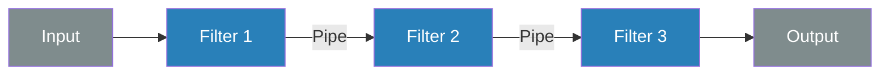
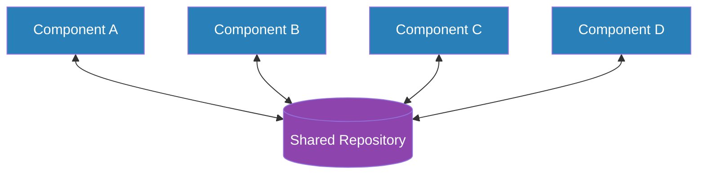
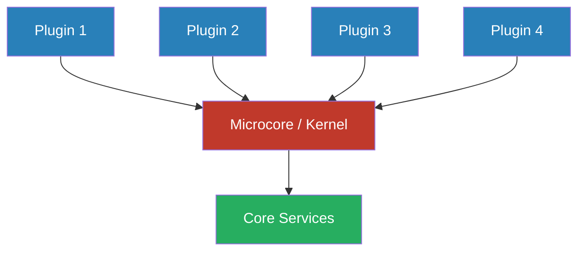
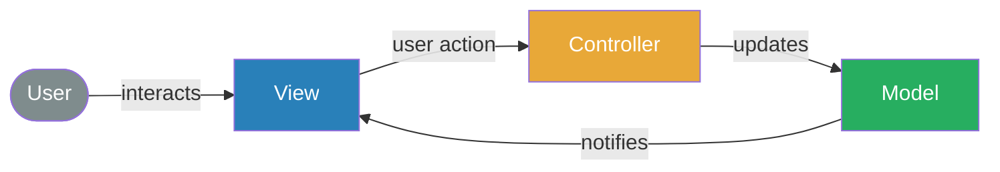

# Meta Architecture

Meta Architecture is the set of high level decisions, which influence the system structure without being the strucutre themselves. Styles, Patterns or principles form the design.
The consistent application of the meta archtiecture ensure coneptional integrity

## Architecutre Patterns

Relevant architecture patterns are the following

### Layered Architecture

Hierarchical structure of a system. Layers a*re seperated by interfaces.

Pro:

* Reusability and Replaciabilty 
* Standardiziation
* Maintenance

Contra:

* Efficiency 

### Pipes & Filters

### Shared Repository

### Microcore Architecture

### Model-View-Controller

