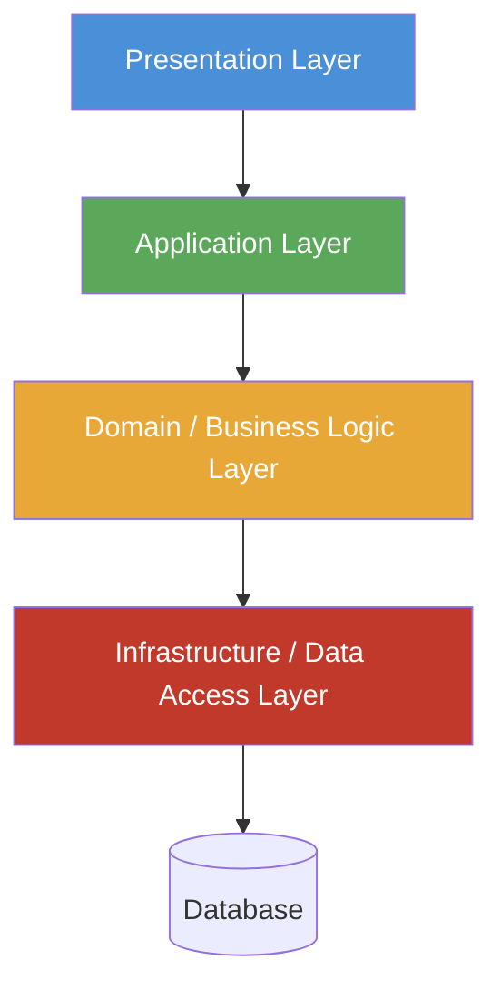
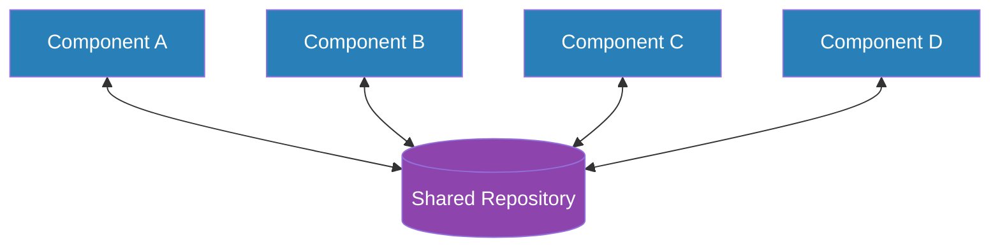
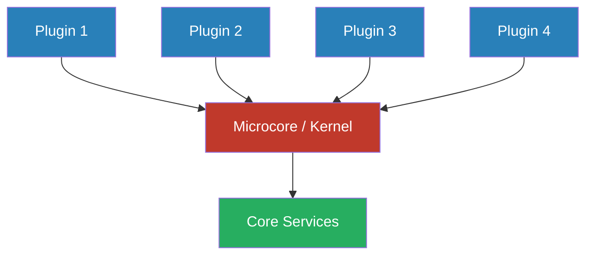
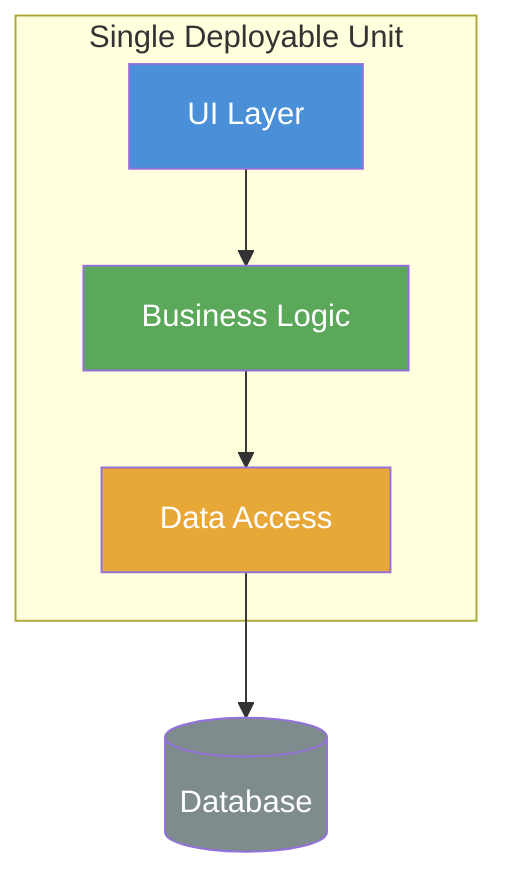
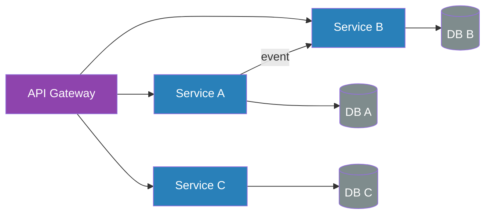
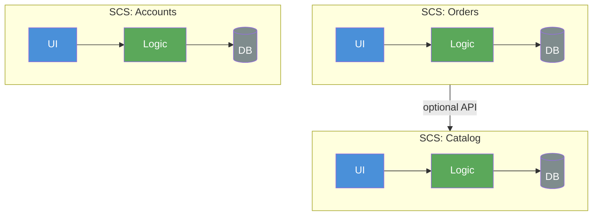

# Meta Architecture

Meta Architecture is the set of high level decisions, which influence the system structure without being the strucutre themselves. Styles, Patterns or principles form the design.
The consistent application of the meta archtiecture ensure coneptional integrity

## Architecutre Patterns

Relevant architecture patterns are the following

### Layered Architecture

Hierarchical structure of a system. Layers a*re seperated by interfaces.

| Pro | Contra |
|-----|--------|
| Reusability and Replaceability | Efficiency |
| Standardization | |
| Maintenance | |

### Pipes & Filters

Data flows through a sequence of independent processing steps (filters) connected by channels (pipes). Each filter transforms the data and passes it on, without knowledge of other filters.

| Pro | Contra |
|-----|--------|
| Filters are independent and reusable | Stateful processing is difficult |
| Easy to add, remove or reorder processing steps | Error handling across filters is complex |
| Supports parallel processing | Overhead from data transformation between steps |

### Shared Repository

Multiple components communicate exclusively through a central, shared data store. Components read and write data without direct dependencies on each other.

| Pro | Contra |
|-----|--------|
| Components are decoupled from each other | Repository becomes a single point of failure |
| Centralized data management and consistency | Potential bottleneck under high load |
| Easy to add new components | Schema changes impact all components |

### Microcore Architecture

A minimal, stable core (kernel) provides basic services. All additional functionality is added via plugins that extend the core without modifying it.

| Pro | Contra |
|-----|--------|
| Highly extensible without touching the core | Plugin interfaces must be designed carefully upfront |
| Core remains small, stable and well-tested | Inter-plugin dependencies can be hard to manage |
| Plugins can be developed and deployed independently | Discovering and loading plugins adds complexity |

### Model-View-Controller

Separates an application into three components: Model (data and business logic), View (presentation), and Controller (input handling). The controller mediates between user input and the model.

| Pro | Contra |
|-----|--------|
| Clear separation of concerns | Can lead to bloated controllers |
| Views and models can evolve independently | Overkill for simple UIs |
| Supports multiple views for the same model | Tight coupling between View and Model through notifications |

### Deployment Monolith

All components of the system are packaged and deployed as a single unit. The entire application runs in one process and is released together.

| Pro | Contra |
|-----|--------|
| Simple to develop and deploy initially | Scales only as a whole, not per component |
| No network overhead between components | Long build and release cycles as the system grows |
| Easy to test end-to-end | A single bug can bring down the entire system |
| Straightforward debugging and tracing | Technology stack is shared across all components |

### Microservices

The system is split into small, independently deployable services. Each service owns its own data and communicates with others via APIs or messaging.

| Pro | Contra |
|-----|--------|
| Services scale independently | Distributed system complexity |
| Teams can develop and deploy services autonomously | Network latency and failure between services |
| Technology stack can differ per service | Harder to test and debug end-to-end |
| Fault isolation: one service failure does not crash others | Operational overhead: many services to monitor and deploy |

### Self-Contained Systems

The system is decomposed into a set of largely autonomous applications. Each Self-Contained System (SCS) includes its own UI, business logic, and data store, and is owned by one team. SCS sit between a monolith and microservices in granularity.

| Pro | Contra |
|-----|--------|
| Each system is independently deployable and testable | Cross-system features require coordination between teams |
| Teams have full ownership including UI and data | UI consistency across systems requires extra effort |
| Less operational complexity than microservices | Coarser granularity may still lead to some coupling |
| Failures are isolated to one system | Shared data between systems must be handled via APIs |

## Architecture Principles

* not concrete decisions or solutions
* Shared understanding
* Shared mindeset
* Can be applied to problems
* long living

Types of principles:

* Defining a goal
* showing a preference
* avoid a technical problem
* Support a work style
* Remind useful observations

Criteria for good principles:

* **Understandable** — every team member can grasp the principle without specialist knowledge
* **Constructive** — the principle gives direction and helps make decisions, not just prohibit them
* **Justifiable** — there is a clear reason why the principle exists; the motivation is transparent
* **Applicable** — the principle can be applied to concrete design decisions
* **Verifiable** — it is possible to check whether a decision follows the principle or violates it
* **Non-trivial** — the principle captures something that would not be obvious without stating it
* **Consistent** — the principle does not contradict other principles in the set
* **Long-lived** — the principle remains valid across multiple projects or system generations