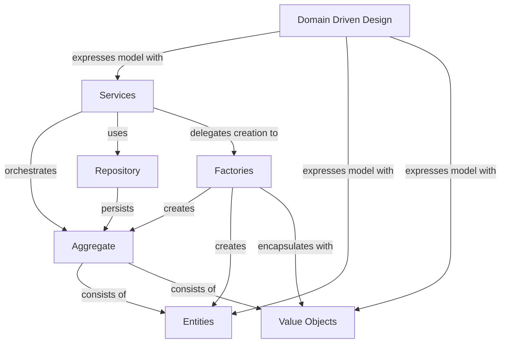

# Modularization

## Views in software architecture

Some aspects are better described with pictures than with text. A single picture is often not enough, different views are needed. 

View seperation can be in

* Logical view
* Development View 
* Process View
* Physical View
* Scenarios

Another separation for views is the **C4 model**, which organizes architecture views into four levels of abstraction:

1. **Context** — Shows the system in its environment: who uses it and what external systems it depends on. Answers: "What does this system do and who interacts with it?"
2. **Containers** — Zooms into the system boundary and shows the high-level technology decisions (apps, databases, services). Answers: "What are the major building blocks and how do they communicate?"
3. **Components** — Zooms into a single container to show its internal components and their interactions. Answers: "How is this container structured internally?"
4. **Code** — Optional deepest level showing how a component is implemented (e.g. UML class diagrams). Usually auto-generated from code.

Each level adds detail while remaining navigable: you start at the big picture and drill down only as needed.

I am personally a fan of [Structurizr](https://structurizr.com), which enables **architecture as code** using the C4 model via a DSL. This keeps diagrams in version control, avoids diagram drift, and allows generating multiple views from a single model.

## Domain Driven Design

* Development of complex systems
* Patterns & Best Practices
* Build on the business view

Core Elements of Domain Driven Design.

| Concept | Description |
|---|---|
| **Services** | Stateless operations that coordinate domain logic across multiple objects. They orchestrate Aggregates, use Repositories to load and store data, and delegate complex object creation to Factories. |
| **Entities** | Objects defined by a unique identity rather than their attributes. They have a lifecycle, can change state over time, and are assembled into Aggregates or created directly by Factories. |
| **Aggregates** | A consistency boundary grouping Entities and Value Objects under a single Aggregate Root. All access goes through the root, enforcing invariants. Persisted via Repositories and created by Factories. |

When using DDD always use the language of the client and make sure it stays clear. 

### Strategical DDD

Contexts independent of each other. So instead of one big model, multiple small ones.

These can have connections and different types like "core", "generic" or "supporting".

### Bounded Context.

Environment in which one word is a certain meaning. Same word can have different meanings. each taem can have their own model. THis is good for microservices for example (when one microservice is developed by one team).

## Modularization of systems

This is normally down in building block view. A blackbox gets more and more logical building blocks.

Building blocks should be defined based on the business. a good base is a domain analysis (as described in DDD). 

Each building block gets assigned connected business requirements. Documentation as text in the model or document.

Good naming is essential.

Resposnibility of each building block needs to be clear, this can be done with an acitivity diagram. 

### Dependencies

Business dependencies

* structural relationships in the domain
* can be encapsulated with technical measures, but not removed completely

Technical dependencies

* Call coupling or so
* can be changed and should be planned.

In case of dependencies every change leads to a domino effect. Each dependencies means more maintenance

When technical dependencies are planned they should follow business dependencies, avoid cycle dependency and not use unnencessary dependencies

#### Dependency Types

* Interfaces
* Factories
* Default Implementation
* Dependency Injection
* Inversion of Control

#### Decide how dependencies should be planned

Generally the highest level of decoupling is not always the goal. Questions defining the degree of independency are:

* How risky is the coupling?
* How clear are the requriremnetns?
* How much does it cost?
* How often do the independent building blocks change?

#### Impact

* Performance 
* Robustness
* Testability
* Extendability 
* Maintainability 
* ...

## Runtime View

Runtime view is basically showing classic use cases for better understanding. This can be a UML sequence, an activity or an state diagram. 

