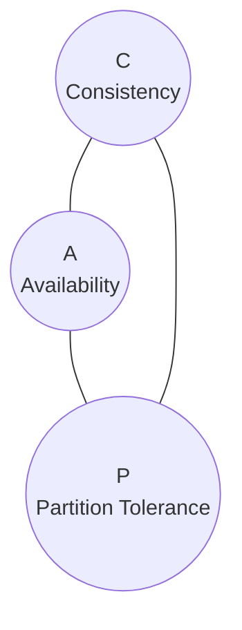
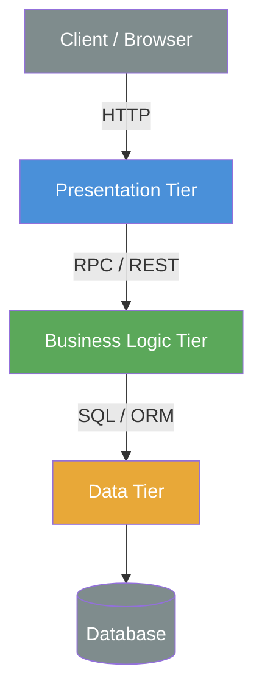
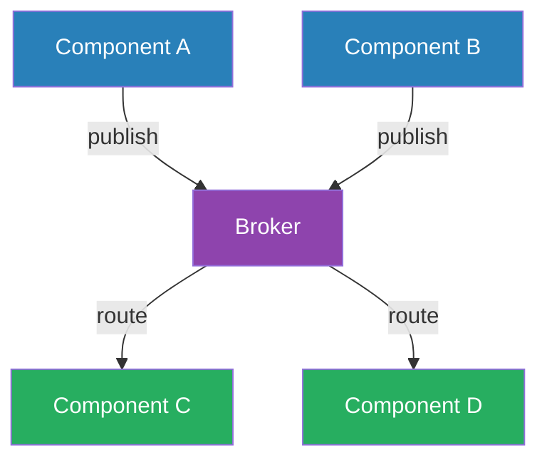
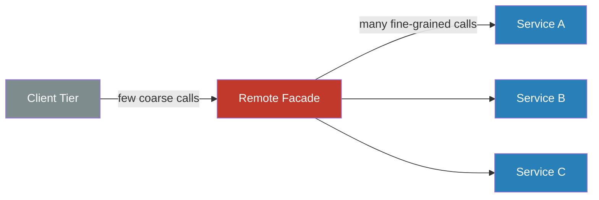
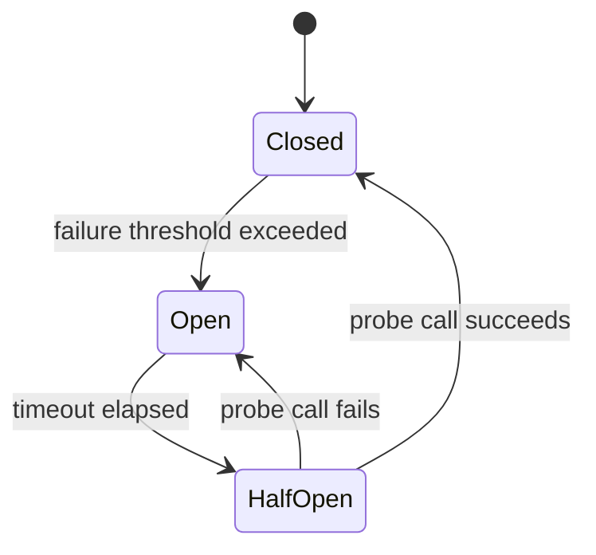
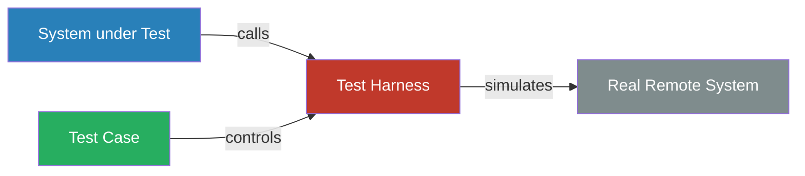

# Concrete Technical Aspects

## Distribution

> In a distributed system, components cooperate over a network. 

Reasons for distribution are:

* Interaction between Users
* Connection to old or 3rd party systems
* Shared use of resources
* higher Availability, reliability and fault tolerance (redudancy) 
* better performance
* better administration.

Generally systems should only be distributed when there is a concrete observable reason to. 

Potential assumptions which lead to problems with distributed systems:

* The network is failsafe
* The topology will never change
* The latency is zero
* The bandwith is infinte.
* The network is secure
* There is only one admin
* Data transport is free
* The network is homogen

## CAP Theorem

Only two at maximum can exist at the same time. 

| Letter | Term                |
|--------|---------------------|
| C      | Consistency         |
| A      | Availability        |
| P      | Partition Tolerance |

## Eventual Consistency 

* *Causal consistency* - a process sees all dependencies 
* *Read-your-writes consistency* - A process sees its own updates
* *Session Consistency* - Read-your writes in context of  a session
* *Monotonic read consistency* - When a process saw an update, it cannot see older values
* *Monotonic write consistency* - writes are done in the correct order.

## Distribution is expensive

* minimize the distribution boundaries in a system
* define bigger interfaces to avoid lots of small calls
* Only distribute independent and complete system parts

## Distribution Pattern

### n-Tier Architecture

The system is divided into horizontal tiers (e.g. Presentation, Business Logic, Data), each deployed separately and communicating only with adjacent tiers over the network. Strict layer boundaries enforce separation of concerns across process boundaries.

| Pro | Contra |
|-----|--------|
| Clear separation of concerns per tier | Network latency between every tier |
| Each tier can be scaled independently | Rigid structure makes cross-tier changes expensive |
| Standard, well-understood pattern | Chattiness between tiers can become a bottleneck |

### Communication between Tiers - Broker

A central broker mediates all communication between components. Senders and receivers are decoupled — they only know the broker, not each other. The broker routes, transforms, or queues messages.

| Pro | Contra |
|-----|--------|
| Senders and receivers are fully decoupled | Broker is a single point of failure |
| Easy to add new consumers without changing producers | Adds latency and operational complexity |
| Supports async communication and load leveling | Debugging message flows is harder than direct calls |

### Communication between Tiers - Remote Facade

A coarse-grained facade is placed at the boundary between tiers. It bundles multiple fine-grained operations into fewer, larger remote calls to reduce network round-trips and hide internal complexity from callers.

| Pro | Contra |
|-----|--------|
| Reduces number of remote calls and network overhead | Facade can become a large, complex catch-all |
| Hides internal structure from remote clients | Changes to internal services may force facade updates |
| Simplifies the client-side interface | Can reduce flexibility for clients needing fine-grained control |

### Circuit Breaker

Wraps remote calls with a state machine that monitors failures. After a threshold is exceeded the circuit "opens" and calls fail fast without hitting the remote system, allowing it time to recover. After a timeout the circuit moves to "half-open" to probe for recovery.

| Pro | Contra |
|-----|--------|
| Prevents cascading failures across services | Threshold and timeout values must be tuned carefully |
| Fails fast instead of waiting for timeouts | Adds complexity to the call path |
| Gives the failing service time to recover | Half-open state requires fallback or retry logic on the caller |

### Test Harness

A controllable replacement for a real remote system used during testing. The harness simulates the interface of the production dependency (including errors, delays, and edge cases) without involving the actual system.

| Pro | Contra |
|-----|--------|
| Tests run without a real network dependency | Harness must accurately reflect real system behavior |
| Can simulate errors, timeouts, and edge cases on demand | Drift between harness and real system can hide bugs |
| Enables fast, deterministic, repeatable tests | Additional code to write and maintain |* 

## Distribution Diagram

Different aspects need to be visualized/documented

* How many processes?
* Which artifacts?
* Which platform (Proxy, Cache, Monitoring...)

The building blocks can be nicely visualized with a UML Deployment diagram.