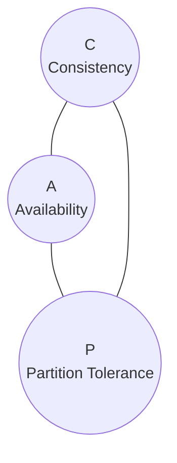

# Concrete Technical Aspects

## Distribution

> In a distributed system, components cooperate over a network. 

Reasons for distribution are:

* Interaction between Users
* Connection to old or 3rd party systems
* Shared use of resources
* higher Availability, reliability and fault tolerance (redudancy) 
* better performance
* better administration.

Generally systems should only be distributed when there is a concrete observable reason to. 

Potential assumptions which lead to problems with distributed systems:

* The network is failsafe
* The topology will never change
* The latency is zero
* The bandwith is infinte.
* The network is secure
* There is only one admin
* Data transport is free
* The network is homogen

## CAP Theorem

Only two at maximum can exist at the same time. 

| C | Consistency
| A | Availability
| P | Partition Tolerance

