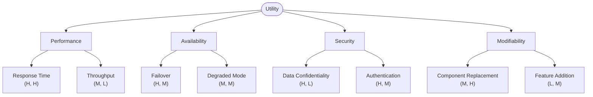

# Architecture Rating

Lots of ways to rate an architecture.

There are qualititative and qunatitative technics.

* Qualitative
 * Subjective assessment
 * Checklists
 * questionaires
 * Scenario based discussion
 * argumentation
* Quantitative
 * Prototyping
 * Mathmatical models 
 * Metrics
 * Measurements
 * Simulation

In total there are 20+ rating patterns. They are depending very much on the use case. 

## ATAM - Architecture Tradeoff Analysis Method

* scenario based qualtitative rating approach
* most mature and common rating method

Goal is to understand the consequences and quality attributes. It should be repeatable and bring up architecture relevant questions early.

Involve stakeholders early in discussion.

### Phases

| Phase | Name | Description |
|-------|------|-------------|
| 0 | Preparation | Define scope, identify stakeholders, plan logistics |
| 1 | Evaluation — Core Team | Present method, business goals, and architecture; build utility tree; analyze approaches |
| 2 | Evaluation — All Stakeholders | Brainstorm and prioritize scenarios, refine analysis, present results |
| 3 | Follow-up | Document findings, consolidate risks and tradeoffs, derive recommendations |

#### Phase 1 — Evaluation (Core Team)

1. Present the ATAM method
2. Present business drivers and goals
3. Present the architecture
4. Identify architectural approaches
5. Generate the quality attribute utility tree
6. Analyze architectural approaches

#### Phase 2 — Evaluation (All Stakeholders)

7. Brainstorm and prioritize scenarios
8. Analyze architectural approaches
9. Present results

### Results

* Tradeoff-Points
* Sensitivity-Points
* Not-Risks
* Risks

### Utility Tree

A utility tree is a hierarchical decomposition of system quality starting from the root node "Utility." The second level lists quality attribute categories (e.g. Performance, Security). The third level refines each category into specific concerns. The leaves are concrete scenarios, each rated by two dimensions: **importance to the business** and **difficulty to achieve** — both on a H/M/L scale. This prioritization guides which architectural approaches to analyze in depth during ATAM.

> Leaf node format: **(Importance to Business, Difficulty to Achieve)** — H = High, M = Medium, L = Low

## Rating method Overview

| Method | Focus | Maturity | Requirements |
|--------|-------|----------|--------------|
| SAAM | Scenario-based evaluation of modifiability and other quality attributes | High — one of the earliest formal methods | Architecture description, scenarios, stakeholders |
| ATAM | Tradeoff analysis across multiple quality attributes | Very high — industry standard | Architecture description, utility tree, stakeholder involvement |
| ARID | Early review of partial designs for fitness of purpose | Medium — lightweight variant of ATAM | Partial design artifacts, representative scenarios |
| SBAR | Simulation-based assessment of runtime behavior | Low–Medium — niche usage | Executable or simulatable architecture model |
| CBAM | Cost-benefit analysis of architectural decisions | Medium — extension of ATAM | Utility tree, cost/benefit data per scenario |
| SACAM | Comparison of candidate architectures against each other | Medium | Multiple architecture candidates, quality scenarios |
| SAEM | Evaluation using enterprise architecture models and metrics | Low–Medium — enterprise-focused | EA models (e.g. TOGAF/ArchiMate), metric definitions |
| AQA | Quantitative quality assessment using static analysis and metrics | Medium | Codebase or model, defined metric thresholds |

## Supporting quantitative technics

ATAM or other qualitive technics can be used for a better complete picture like doing a prototype or checking metrics.

