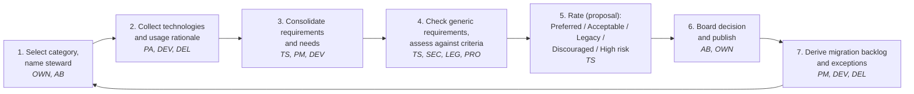
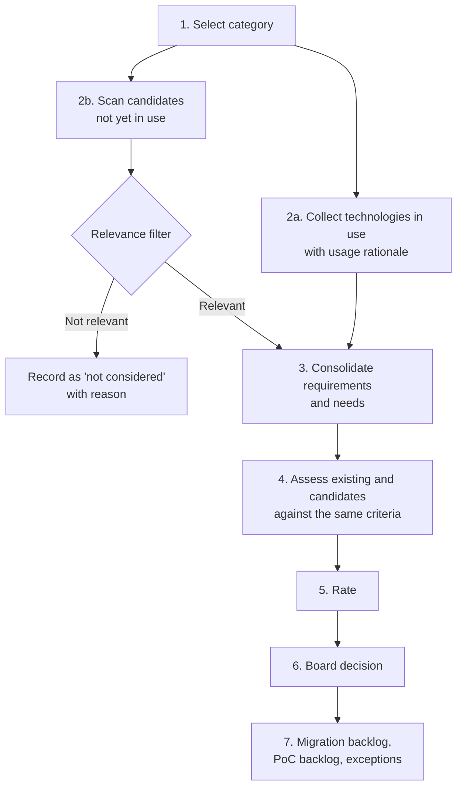
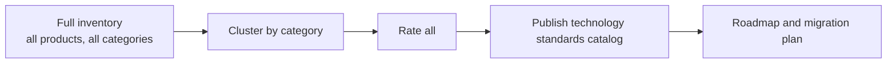
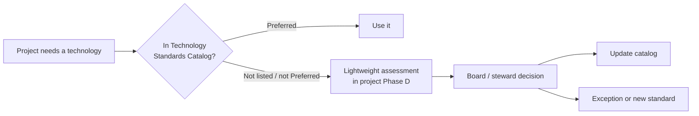
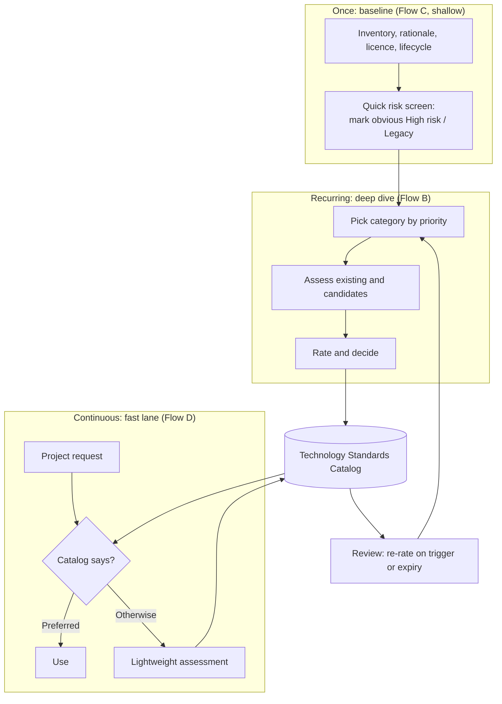
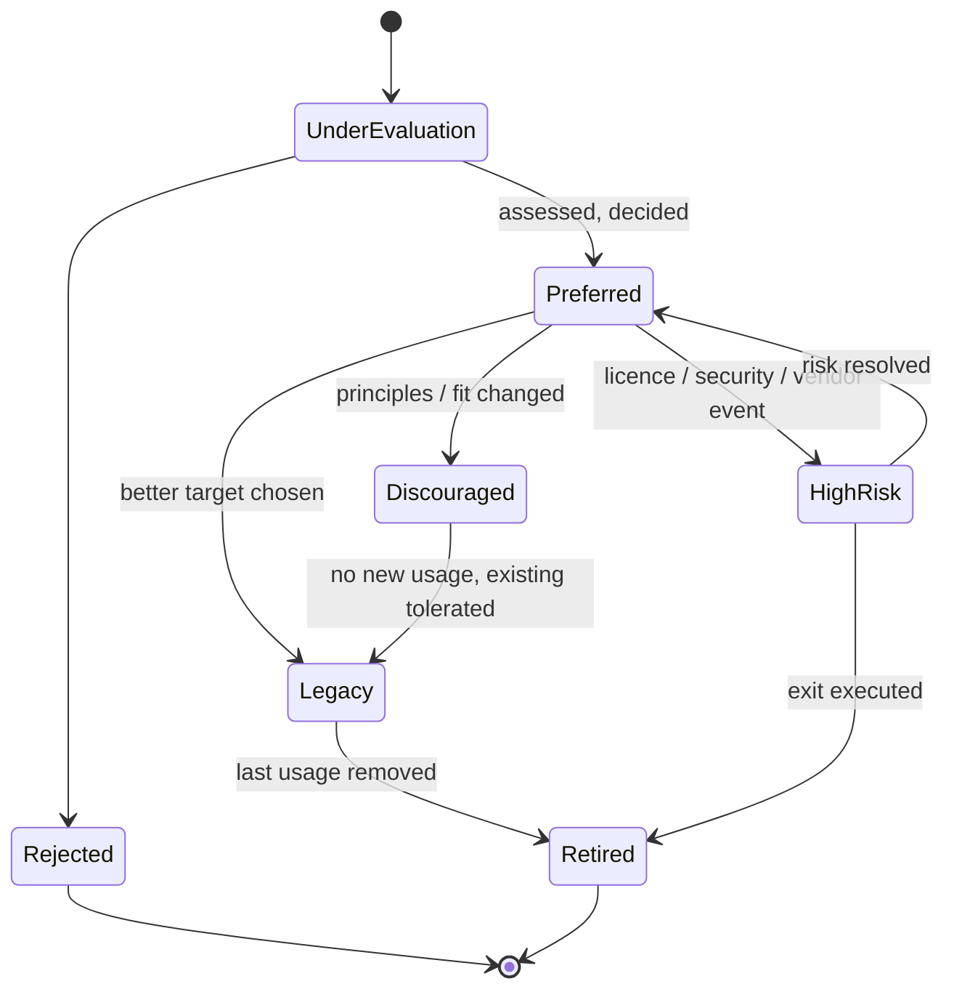
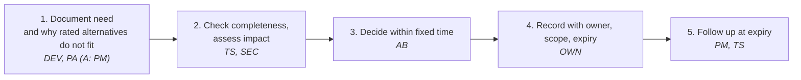

# Technology Harmonization across Products

!!! note "Status: Draft / proposal"
    This chapter is a planning document. It proposes processes, it does not yet describe an established practice.

!!! info "Made with Claude"
    This chapter was drafted with the help of Claude (AI assistant by Anthropic) and then reviewed and decided on by the author. Sources were checked as far as stated in the verification note below; verify citations before relying on them.

## Goal

Several products grow over time and each team picks its own libraries, frameworks, databases, engines and platforms.
Some of this diversity is useful, most of it is accidental and costs money: more skills to maintain, more licences, more security patching, and harder staffing across teams.

The goal is to **harmonize software components over products** in a controlled, transparent way:

* Know which technologies are in use, where, and why.
* Make a deliberate, documented decision per technology.
* Give new projects a clear default ("paved road") without blocking justified exceptions.
* Keep the decisions alive, because technology and licences change.

## Standards this builds on

Nothing here is new. The flows are assembled from established building blocks:

| Standard | What is reused | Source |
|---|---|---|
| TOGAF® 10 ADM Phase D (Technology Architecture) | Baseline vs. target technology architecture, gap analysis. Technology Architecture outputs include the Technology Standards catalog and the Technology Portfolio catalog | [1], [2] |
| TOGAF® Technology Portfolio catalog | List of *all technology in use* (hardware, infrastructure software, application software). Typically the start point of the Technology Architecture phase and the foundation for the other matrices and diagrams. This is the inventory of the flows below | [2], [5] |
| TOGAF® Technology Standards catalog | Agreed technology standards with versions, lifecycles and refresh cycles. Also used to identify discrepancies across the enterprise. This is where the ratings below are recorded | [2], [6] |
| TOGAF® Architecture Board | Cross-organisation decision body: basis for decisions on architectures, enforcing compliance, granting dispensations (= exceptions here), recommended four to five and no more than ten permanent members | [3] |
| TOGAF® Architecture Compliance | Reviewing that projects conform to the agreed architecture and standards | [4] |
| TOGAF® Phase E/F and Phase G/H, Principles, Requirements Management | Migration planning, governance, change management, criteria for rating | [1] (names only, content not individually verified) |
| Gartner TIME model: Tolerate, Invest, Migrate, Eliminate | Inspiration only. TIME rates **applications** on *business value* × *technical fit*; it is not defined for technologies. The rating scale below is a technology-level analogue, not a mapping | [7] |
| Thoughtworks Technology Radar: Adopt, Trial, Assess, Hold | Rings for communicating the result. *Hold* means "don't start anything new with this, no harm in existing projects", which corresponds closely to *Legacy*/*Discouraged* below. *Assess* corresponds to *Under evaluation* | [8] |
| ISO/IEC 25010 | Product quality characteristics as a checklist for the quality criteria (see [Architecture Rating](ISAQB-CPSA/10-architecture-rating.md)) | [9] |
| arc42 section 10 (Quality Requirements) | Format for making quality requirements specific and measurable | [10] |
| SPDX | Standardised licence identifiers for the `Licence` field of the inventory | [11] |
| ITIL 4 (continual improvement, change enablement) | Idea for the review cycle. Not verified against the publication | not verified |

!!! warning "Verification status"
    Primary sources are the **TOGAF® Standard, 10th Edition** ([1] to [4]). That the Technology Standards catalog and the Technology Portfolio catalog are Technology Architecture outputs of the 10th edition was confirmed through search results for [1] and [2]; the pages themselves could not be opened here (network proxy). The detailed wording of both catalog definitions in the table is quoted from the TOGAF 9.0 work product pages [5], [6], because only those were readable. Check the wording against [2] before quoting it as TOGAF 10.
    Sources [7] and [8] are secondary or vendor texts; the primary Gartner definition is paywalled.

## Building blocks shared by all flows

### Generic requirements (apply to every technology)

Before any category-specific assessment, every technology must pass the **generic requirements**. They apply to all categories and are defined once by the architecture board, not per cycle. A technology failing a generic requirement cannot be rated *Preferred* or *Acceptable*.

Examples of what belongs here (the concrete content is the organisation's decision):

* Permitted and forbidden open source licence families (for example "no strong copyleft in distributed products").
* **Deployment constraints**, including on-premise: runs without internet access, no mandatory SaaS dependency, supported on customer-provided platforms.
* Minimum security and support expectations (maintained, security fixes available).
* Compliance obligations that hold for all products.

Customer-mandated or on-premise constraints are part of this list, not a separate mechanism. The *licence assessment itself* (how a licence is analysed and classified) is **not defined in this flow**. The flow only consumes its result as a pass/fail input to the generic requirements.

### Technology categories ("types")

Technologies are always assessed per **category**, never as one flat list. Comparing a message broker with a UI framework is meaningless.

The set of categories is **open-ended and configured per use case**. There is no fixed or complete list. Typical examples:

* Databases (relational, document, search, time series)
* Key-value stores and caches
* Runtimes and programming languages
* UI frameworks
* Messaging and integration
* Workflow and process engines (see [Workflow Engines](../technologies/Workflow-Engines/index.md))
* Identity and access
* Observability
* Build, CI/CD and packaging
* Runtime platforms (containers, orchestration, cloud services)

**Defining a category.** A category is created when someone starts the process for it (a product architect or the board requests it). The definition is short: name, scope (what is in, what is out), and the steward. Overlapping categories are avoided by scope statements; a technology belongs to exactly one category, additional uses are noted in the inventory.

**Order.** The order is not fixed. It follows the priority score from Flow E (products affected × risk × cost) and is decided by the board when planning cycles. A category is also started on demand, for example when a project needs a decision in a category that has no ratings yet.

### Inventory record (minimum data per technology and product)

| Field | Description |
|---|---|
| Technology and version | Name, version, vendor or community |
| Category | One of the configured categories |
| Product(s) using it | Link to the product |
| Usage rationale | *Why* is it used? Which requirement or need does it serve? |
| Licence | SPDX identifier, commercial terms, cost |
| Lifecycle | Release date, end of support, community health |
| Owner | Person who answers questions about it |
| Replaceability | How deeply is it embedded (library vs. data model vs. platform)? |

### Rating scale

Ratings are **binding for all products**. The scale, with a precise definition so that ratings stay comparable:

| Rating | Meaning | New products | Existing products |
|---|---|---|---|
| **Preferred** | Default choice. Passes generic requirements, supported, skills available, fits principles | Use by default | Keep |
| **Acceptable** | Good in a defined context, but not the default (conditions below) | Allowed only if a documented condition holds | Keep |
| **Legacy** | Still supported, but no longer a target | Not allowed | Keep, migrate at natural opportunity |
| **Discouraged** | Works, but better alternatives exist or it conflicts with principles | Not allowed without exception | Plan migration |
| **High risk** | Licence, security, vendor, end-of-life or compliance risk | Forbidden | Mitigation or exit plan with deadline |
| **Under evaluation** | Not yet assessed (a *state*, not a rating) | Request assessment first | Schedule assessment |

**When is a technology *Acceptable* (and not Preferred)?** Every *Acceptable* rating must state its conditions in the catalog. A technology is only rated *Acceptable* if it passes the generic requirements **and** at least one of these applies. The conditions are written into the rating, for example:

* **Context-specific fit:** it is the better choice for a clearly bounded use case (for example a search engine for full-text search while a relational database is Preferred for general data).
* **Preferred option does not cover a documented requirement:** the Preferred technology fails a specific, recorded requirement of the product.
* **Transition:** it is the planned target or a stepping stone for a migration and not yet fully rolled out.
* **Platform constraint:** a platform, partner or customer environment prescribes it (and the generic requirements are still met).

Not valid reasons: personal preference, team familiarity alone, or "we already started". Familiarity may be noted but does not justify *Acceptable* on its own. *Acceptable* is reviewed at the normal review date and drops to *Discouraged* or *Legacy* when its condition no longer holds.

Notes:

* *Legacy* and *Discouraged* are deliberately different. Legacy is a lifecycle statement ("was fine, is aging"), Discouraged is a judgement ("we would not choose it").
* *High risk* should always name the **risk type** (licence, security, vendor lock-in, end of support, compliance) so mitigation can be targeted.
* Every rating carries a **review date**. A rating without expiry rots.
* An **exception process** is mandatory because ratings are binding (see the Architecture Contract and Change Request documents in the [Content Framework](Content-Framework/index.md)). Exceptions are decided by the architecture board only, are limited in scope and time, and are recorded in the catalog.

### Rating criteria (for the "requirements and needs are checked" step)

1. **Functional fit**: covers the collected requirements and needs.
2. **Quality attributes**: performance, security, operability, scalability, maintainability.
3. **Cost**: total cost of ownership. Licence compliance is a generic requirement (a pre-condition), not weighed here.
4. **Vendor and community health**: release cadence, bus factor, roadmap, support options.
5. **Skills**: available in the organisation and on the labour market.
6. **Integration**: fit with the existing stack and with the architecture principles.
7. **Exit cost**: how hard is it to leave again?

Weight the criteria per category. Document the weights once, not per assessment.

### Roles

Abbreviations are used in the flows and the RACI below. **Not every role takes part in every process**; the flow tables list only the roles that are involved, all others are not needed for that step.

| Abbr. | Role | Task in this process |
|---|---|---|
| **TS** | Technology steward (per category) | The one coordinating the assessment. Appointed **when the process for the category is started**. Owns inventory and ratings of the category, prepares assessments and the decision proposal |
| **PM** | Product management | Brings business needs and priorities, owns the product roadmap and therefore the migration decisions of a product. Accountable for exception requests of their product |
| **DEV** | Product development | Provides usage and rationale for the technologies in their product, evaluates candidates, runs proofs of concept, implements migrations |
| **DEL** | Delivery (operations, release, customer deployment) | Brings operational facts: operability, incidents, patching effort, on-premise deployment constraints. Executes rollouts |
| **AB** | Architecture board | TOGAF-style board. Takes the **final decision** on ratings, generic requirements and exceptions (dispensations). Small and time-boxed |
| **PA** | Product architect | Links the product to the process: validates inventory data, brings architecture requirements, checks compliance of the product against the catalog |
| **OWN** | Process owner / architecture office | Owns the process itself, plans cycles, prepares board meetings, maintains and publishes the catalog (catalog custodian) |
| **SEC** | Security | Assesses security aspects of technologies, reports vulnerabilities and security incidents as re-rating triggers |
| **LEG** | Legal and compliance | Owns the licence and compliance rules behind the generic requirements. (The licence assessment method itself is outside this flow) |
| **PRO** | Procurement / vendor management | Brings contract, cost and vendor situation for commercial technologies |

Optional roles, added when needed: **QA / test** (test tooling categories), **Support** (customer-facing impact of technology changes), **Data protection officer** (categories that touch personal data), **Customers or partners** as source of external constraints (represented through PM, never directly decision making).

The steward proposes, the board decides. The steward does not decide alone, and the board does not prepare assessments.

### RACI (generic)

R = responsible (does the work), A = accountable (one per row, owns the result), C = consulted, I = informed, blank = not involved. This is the default; the board may adapt it to the organisation.

| Activity | OWN | TS | PM | DEV | DEL | PA | AB | SEC | LEG | PRO |
|---|---|---|---|---|---|---|---|---|---|---|
| Maintain the process itself | A/R | C | C | | C | C | C | | | |
| Draft and maintain generic requirements | R | C | C | | C | C | A | R | R | C |
| Prioritise categories, define category, appoint steward | R | I | C | | | C | A | | | |
| Provide inventory data per product | I | A | C | R | C | R | | | | |
| Consolidate requirements and needs | | A/R | R | R | C | C | I | C | | |
| Scan candidates not yet in use (Flow B) | | A/R | I | C | | C | | C | C | C |
| Assess against generic requirements and criteria | | A/R | C | C | C | C | I | C | C | C |
| Proof of concept | | A | I | R | C | C | | C | | |
| Prepare rating proposal | | A/R | C | C | C | C | I | | | |
| **Decide rating** | I | C | C | I | I | C | A/R | C | C | |
| Publish catalog | A/R | R | I | I | I | I | I | | | |
| Plan migration or exit | | C | A | R | R | C | I | | | |
| Fast lane: request a technology decision (Flow D) | | C | A | R | C | R | I | | | |
| Fast lane: decide on request | I | R | I | I | | C | A | C | | |
| Request an exception | | C | A | R | | C | I | C | | |
| **Decide an exception** | I | C | C | I | I | C | A/R | C | C | |
| Check product compliance against the catalog | A | C | I | C | C | R | I | | | |
| Trigger re-rating (expiry, vulnerability, licence event) | C | A/R | I | | C | | I | R | R | C |

Notes:

* The board stays small. Decisions in the fast lane may be **delegated** to the steward for low-impact cases (for example a library inside a Preferred framework). The delegation rule is set by the board.
* PM is accountable for migrations and exceptions because they own the product's priorities and budget. Delivering the change is DEV and DEL.

---

## Flow A: Category-by-category cycle (inventory → assess → decide)

This is the flow described in the request. One category at a time is run through the full loop, and **only technologies that are already in use** are in scope.

Roles are shown in italics below each step (abbreviations: see [Roles](#roles)). Only the roles named in a step are involved.

| Step | Result | A (accountable) | R (responsible) | C (consulted) | TOGAF® reference |
|---|---|---|---|---|---|
| 1. Select category | Category definition, named steward, priority (by cost, risk or pain) | AB | OWN | PM, PA | Preliminary, Phase A |
| 2. Collect | Inventory records for all products | TS | PA, DEV | DEL, PM | Phase D baseline |
| 3. Consolidate | Requirement list per category, with product-specific needs flagged | TS | PM, DEV | DEL, PA, SEC | Requirements Management |
| 4. Assess | Scoring per criterion, rationale documented | TS | TS | DEV, DEL, PA, SEC, LEG, PRO | Phase D gap analysis |
| 5. Rate | Rating proposal per technology plus risk type | TS | TS | PA, PM, DEV, DEL | Technology Standards catalog |
| 6. Decide | Decision record, published catalog | AB | AB, OWN (publish) | TS, PM, SEC, LEG, PA | Architecture Board |
| 7. Derive | Migration candidates, exceptions, owners | PM | DEV, DEL | TS, PA | Phase E/F |

**Pros**

* Small, finishable scope per cycle, visible results early.
* Requirements are known before anything is rated, so ratings are evidence based.
* Learning effect: the second category goes faster than the first.
* Fits a limited architecture capacity (one steward, one category).

**Cons**

* Only existing technologies are judged. A better alternative nobody uses yet is never considered, so the result can cement the status quo.
* Can pick a "best of the bad" technology as Preferred.
* Cross-category dependencies (for example a framework that dictates the database driver) are seen late.
* Landscape-wide picture takes many cycles.

**Mitigation:** Add Flow B as step 4a (see below).

---

## Flow B: Category cycle with horizon scanning (existing + candidates)

Same as Flow A, but each cycle also looks at **technologies not yet in use** which are relevant for the category. This is the explicit extension requested.

**Keeping scope under control (the scope-creep guard):**

* **Relevance filter** with hard entry criteria. A candidate is only assessed if at least one holds:
    * it is requested by a product team for a concrete need,
    * it is a recognised leader or successor in the category (radar, analyst reports, community standard),
    * it solves a documented problem of a technology currently in use (cost, risk, end of life).
* **Cap** the number of candidates per cycle (for example max. 3 to 5).
* **Time-box** the scan (for example 2 weeks) and the whole cycle (for example 6 to 8 weeks).
* Candidates get a lighter first assessment. Only candidates passing a go/no-go move to a **proof of concept**; the PoC is a separate, scheduled work item, not part of the cycle.
* New technologies start as **Under evaluation** (radar ring *Assess*), never directly as *Preferred*.

**Roles added compared to Flow A:**

| Step | A | R | C | Note |
|---|---|---|---|---|
| 2b. Scan candidates | TS | TS | DEV, PA, SEC, PRO | Each candidate gets an advocate (usually DEV) and a critic (usually SEC or PA) |
| Relevance filter | TS | TS | PM, PA | Entry criteria applied by the steward, borderline cases to the board |
| Proof of concept (separate work item) | TS | DEV | DEL, SEC, PA | Scheduled by PM, not part of the cycle time-box |

All other steps as in Flow A.

**Pros**

* Avoids cementing the status quo, finds better targets for the Legacy/Discouraged items.
* Rating of existing technology is calibrated against real alternatives.
* Supports a defensible decision ("we looked at alternatives X and Y").

**Cons**

* More effort per cycle, higher risk of scope creep without the guard above.
* Needs people with market knowledge, not only product knowledge.
* Risk of "shiny object" bias; candidates need an advocate *and* a critic.

---

## Flow C: Landscape-wide assessment ("all technology at once")

All categories are inventoried and rated in one program.

**Roles:** this is a programme, not a recurring cycle.

| Step | A | R | C |
|---|---|---|---|
| Programme set-up, categories clustered | AB | OWN | TS (all appointed up front), PM |
| Full inventory | OWN | PA, DEV | DEL, PM |
| Shallow rating and risk screen | AB | TS (per category) | SEC, LEG, PRO |
| Publish catalog and roadmap | OWN | OWN, TS | PM, DEL, AB |

Because all stewards work in parallel, the board and the architecture office are the bottleneck.

**Pros**

* Complete picture, cross-category dependencies visible.
* One consistent decision round, one communication moment.
* Good fit after a merger or acquisition, or before a platform strategy.
* Strong basis for a business case (total cost, licence exposure).

**Cons**

* High scope-creep risk, long time to first result, value only at the end.
* Heavy load on product teams for data collection in one burst.
* Data quality drops with volume; ratings become shallow.
* Stakeholder fatigue and decision backlog at the board.
* Everything is a snapshot that is outdated when finished.

**When it is justified:** a one-off *baseline* for a cheap, shallow first pass (inventory and risk screening only), followed by Flow A/B for depth. See Flow E.

---

## Flow D: Product-driven (demand-led) assessment

No up-front cycle. Technology choices are checked **when a project or product needs one** (new product, major release, new component). This is the classic TOGAF® project-level flow: Phase D of the project feeds the catalog.

**Roles:** only a few roles are needed. The fast lane skips DEL, PRO and LEG unless the request touches them.

| Step | A | R | C | I |
|---|---|---|---|---|
| Project states the need | PM | DEV, PA | TS | |
| Lookup in catalog, Preferred: use it | PM | DEV | | TS |
| Lightweight assessment | AB | TS | PA, SEC, DEL (operability) | PM, DEV |
| Decision (or delegated to TS for low-impact cases) | AB | AB | TS, PM | DEV, OWN |
| Update catalog | OWN | OWN, TS | | AB |

**Pros**

* Lowest overhead, effort is only spent where a decision is actually needed.
* Decisions are made with concrete requirements and context.
* Naturally keeps the catalog relevant to real demand.

**Cons**

* Reactive: existing sprawl is never cleaned up on its own.
* Inconsistent depth, depends on the individual project architect.
* Risk of the "decision by whoever shouts first", local optimisation.
* Needs an initial catalog, otherwise there is no reference.

---

## Flow E: Hybrid (recommended starting point)

Combine a shallow landscape-wide baseline with deep category cycles and a demand-led fast lane. Each flow covers the weakness of another.

Priorities for the deep dives can be driven by a simple score: **number of products affected × risk × cost**. Start where the pain is largest, not where the category list begins.

**Roles per mechanism:**

| Mechanism | A | R | C | Roles *not* involved |
|---|---|---|---|---|
| Baseline (Flow C, shallow) | OWN | PA, DEV | TS, SEC, LEG, DEL | PRO, PM (informed only) |
| Deep dive (Flow B) | AB | TS | PM, DEV, DEL, PA, SEC, LEG, PRO | none, this is the full flow |
| Fast lane (Flow D) | AB | TS | PA, DEV | LEG, PRO (only if relevant), DEL (only for operability) |

**Pros**

* Early value: the baseline surfaces the worst risks (for example licence issues) within weeks.
* Deep, evidence-based ratings where it matters, bounded scope per cycle.
* Projects are never blocked: the fast lane answers within days.
* Self-correcting: fast lane decisions feed the catalog, expiry dates trigger re-rating.

**Cons**

* Three mechanisms to run and explain; needs clear governance.
* Baseline data will be rough and must be improved in the cycles.
* Needs discipline that fast lane decisions really flow back into the catalog.

---

## Supporting flow: Review and re-rating (lifecycle)

Ratings must change when the world changes. Triggers:

* Review date expired (for example every 12 months, 6 months for *High risk*).
* Licence change of the vendor, acquisition, or end-of-support announcement.
* Critical vulnerability or repeated security incidents.
* New product requirement which the current rating did not consider.
* Migration completed: set to *Legacy* → *retired*.

| Trigger | Detected by (R) | Accountable | Decides |
|---|---|---|---|
| Review date expired | OWN | TS | AB (on proposal) |
| Licence change, acquisition, end of support | LEG, PRO, TS | TS | AB |
| Critical vulnerability or repeated incidents | SEC, DEL | TS | AB |
| New product requirement not covered by the rating | PM, DEV, PA | TS | AB |
| Migration completed | DEV, DEL | PM | TS updates the state to *Retired*, AB informed |

## Supporting flow: Exception handling

An exception (a *dispensation* in TOGAF® terms, granted by the Architecture Board [3]) is the only way to deviate from a binding rating.

1. Team documents need and why the rated alternatives do not fit. PM is accountable that the need is real, DEV and PA prepare it.
2. Steward checks completeness and impact (SEC is consulted when risk is involved). The architecture board decides within a fixed time (for example 5 working days).
3. Exception is recorded with owner, scope and **expiry date** by the architecture office.
4. At expiry the product either migrates or requests a renewal. Repeated exceptions for the same need are a signal to re-assess the category.

Roles not involved by default: DEL, PRO, LEG (consulted only when the exception touches their area).

## Comparison of flows

| Criterion | A: Category cycle | B: + Horizon scan | C: All at once | D: Demand-led | E: Hybrid |
|---|---|---|---|---|---|
| Time to first result | Medium | Medium to long | Long | Short | Short |
| Depth of assessment | High | High | Low to medium | Varies | High where it matters |
| Considers technologies not yet in use | No | Yes | Rarely | Only ad hoc | Yes |
| Scope-creep risk | Low | Medium (guarded) | High | Low | Medium |
| Effort on product teams | Medium | Medium | High (burst) | Low | Medium, spread out |
| Cleans up existing sprawl | Yes, step by step | Yes | Yes, via roadmap | No | Yes |
| Cross-category view | Weak | Weak | Strong | None | Medium (baseline) |
| Governance complexity | Low | Medium | Medium | Low | Higher |
| Fits small architecture team | Yes | Partly | No | Yes | Partly |

## Recommendation

1. Start with **Flow E**, but keep the baseline shallow (inventory and obvious risks only).
2. Run the first deep dive as **Flow B** on one category with high pain and few candidates, as a pilot, to calibrate effort, criteria and the rating scale.
3. Run **Flow D** from the start for new projects, fed by the first catalog version.
4. Review the process itself after two cycles.

If architecture capacity is very small, use Flow A plus Flow D and add horizon scanning only when a Legacy/Discouraged rating needs a successor.

## Decisions taken

Decided:

| Question | Decision |
|---|---|
| Which categories, in which order? | Open-ended, configured per use case. Order by priority score or on demand, decided by the board (see Technology categories) |
| Steward and decision | Steward per category, named at process start. Final decision by the architecture board |
| Binding? | Ratings are binding for all products. Deviations only through the exception process |
| Generic requirements | Defined once, apply to all technologies (for example permitted licence families) |
| On-premise and customer constraints | Part of the generic requirements |
| Where is the catalog stored? | In the tool already used by the organisation (Confluence, Git, SharePoint, ...). The process is tool-agnostic. See [Architecture Repository](Content-Framework/Documents/arch-repository.md) |
| Rating scale | Extended by *Acceptable* with explicit conditions |
| Licence assessment | Not defined in this flow. Only its result is used as generic requirement input |

## Sources

1. The Open Group: [TOGAF® Standard (10th Edition), ADM – Phase D: Technology Architecture](https://pubs.opengroup.org/togaf-standard/adm/chap08.html)
2. The Open Group: [TOGAF® Standard (10th Edition), Architecture Content](https://pubs.opengroup.org/togaf-standard/architecture-content/index.html)
3. The Open Group: [TOGAF® Standard (10th Edition), EA Capability and Governance – Architecture Board](https://pubs.opengroup.org/togaf-standard/ea-capability-and-governance/chap04.html)
4. The Open Group: [TOGAF® Standard (10th Edition), EA Capability and Governance – Architecture Compliance](https://pubs.opengroup.org/togaf-standard/ea-capability-and-governance/chap06.html)
5. The Open Group: [Artifact: Technology Portfolio Catalog](https://pubs.opengroup.org/architecture/togaf90-doc/epf/TOGAF9/workproducts/Technology%20Portfolio%20Catalog_1B13325D.html) (TOGAF 9.0 work product, quoted for wording only)
6. The Open Group: [Artifact: Technology Standards Catalog](https://pubs.opengroup.org/architecture/togaf90-doc/epf/TOGAF9/workproducts/Technology%20Standards%20Catalog_D8B8157.html) (TOGAF 9.0 work product, quoted for wording only)
7. LeanIX: [Gartner TIME model](https://www.leanix.net/en/wiki/ea/gartner-time-model) (secondary source for Gartner's TIME framework)
8. Thoughtworks: [Build your own Technology Radar](https://www.thoughtworks.com/en-de/insights/blog/build-your-own-technology-radar)
9. arc42 Quality Model: [ISO/IEC 25010](https://quality.arc42.org/standards/iso-25010); standard itself: ISO/IEC 25010:2023
10. arc42: [Section 10 – Quality Requirements](https://docs.arc42.org/section-10/)
11. SPDX: [Handling licence information / SPDX licence identifiers](https://spdx.dev/learn/handling-license-info/)
12. The Open Group: [TOGAF® Series Guide: Architecture Skills Framework](https://pubs.opengroup.org/togaf-standard/architecture-skills-framework/) (title only checked; the roles in this chapter are adapted to product organisations and not taken from it)
