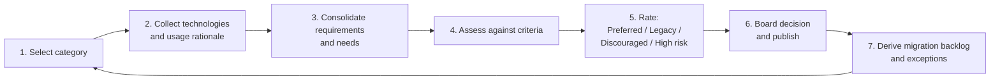
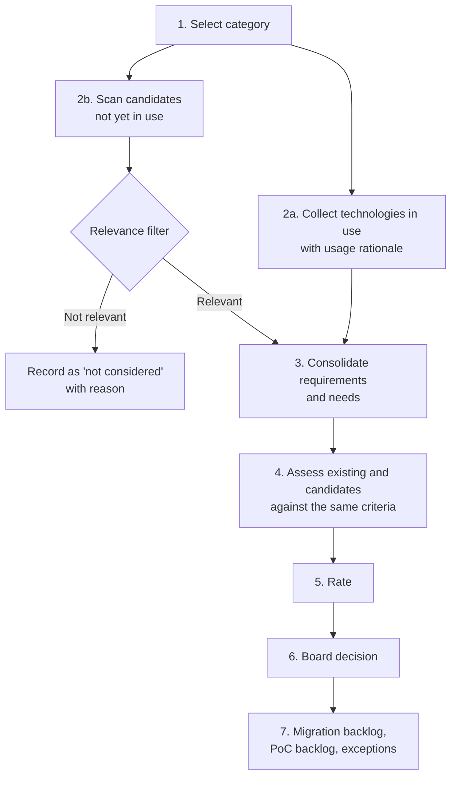
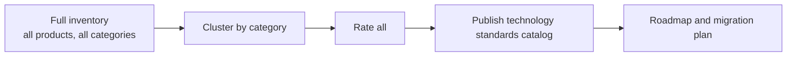
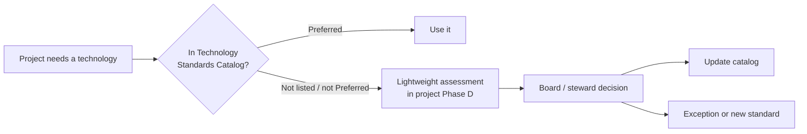
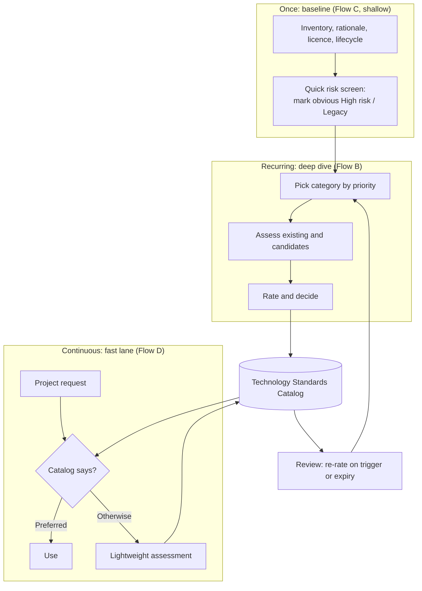
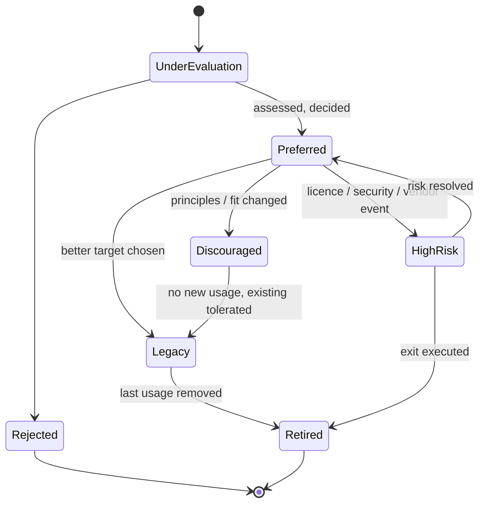

# Technology Harmonization across Products

!!! note "Status: Draft / proposal"
    This chapter is a planning document. It proposes processes, it does not yet describe an established practice.

## Goal

Several products grow over time and each team picks its own libraries, frameworks, databases, engines and platforms.
Some of this diversity is useful, most of it is accidental and costs money: more skills to maintain, more licences, more security patching, and harder staffing across teams.

The goal is to **harmonize software components over products** in a controlled, transparent way:

* Know which technologies are in use, where, and why.
* Make a deliberate, documented decision per technology.
* Give new projects a clear default ("paved road") without blocking justified exceptions.
* Keep the decisions alive, because technology and licences change.

## Standards this builds on

Nothing here is new. The flows are assembled from established building blocks:

| Standard | What is reused |
|---|---|
| TOGAF® ADM Phase D (Technology Architecture) | Baseline vs. target technology architecture, gap analysis |
| TOGAF® Technology Portfolio Catalog and Technology Standards Catalog | The catalogs where technologies and their lifecycle status are recorded (see [Architecture Repository](Content-Framework/Documents/arch-repository.md)) |
| TOGAF® Phase E/F and Phase G/H | Migration planning, governance, compliance and change management |
| TOGAF® Architecture Principles and Requirements Management | Criteria that technologies are rated against |
| TIME model (Gartner): Tolerate, Invest, Migrate, Eliminate | Disposition of existing applications and technologies. The rating below is a technology-level variant of it |
| ThoughtWorks Technology Radar (Adopt, Trial, Assess, Hold) | Rings for new and emerging technologies. Good for communicating the result |
| ITIL 4 Service Value System | Continual improvement and change enablement for the review cycle |
| ISO/IEC 25010 and arc42 chapter 10 | Quality attributes as rating criteria (see [Architecture Rating](ISAQB-CPSA/10-architecture-rating.md)) |

## Building blocks shared by all flows

### Technology categories ("types")

Technologies are always assessed per **category**, never as one flat list. Comparing a message broker with a UI framework is meaningless.
Suggested categories (adapt to the product landscape):

* Programming languages and runtimes
* Frameworks and libraries (backend, frontend)
* Data stores (relational, document, search, cache, time series)
* Messaging and integration
* Workflow and process engines (see [Workflow Engines](../technologies/Workflow-Engines/index.md))
* Identity and access
* Observability (logging, metrics, tracing)
* Build, CI/CD and packaging
* Runtime platforms (containers, orchestration, cloud services)

### Inventory record (minimum data per technology and product)

| Field | Description |
|---|---|
| Technology and version | Name, version, vendor or community |
| Category | One of the categories above |
| Product(s) using it | Link to the product |
| Usage rationale | *Why* is it used? Which requirement or need does it serve? |
| Licence | SPDX identifier, commercial terms, cost |
| Lifecycle | Release date, end of support, community health |
| Owner | Person who answers questions about it |
| Replaceability | How deeply is it embedded (library vs. data model vs. platform)? |

### Rating scale

The scale proposed in the request, with a precise definition so that ratings stay comparable:

| Rating | Meaning | New products | Existing products |
|---|---|---|---|
| **Preferred** | Default choice. Supported, skills available, fits principles | Use by default | Keep |
| **Acceptable** *(optional addition)* | Fine for a specific context, but not the default | Allowed with short rationale | Keep |
| **Legacy** | Still supported, but no longer a target | Not allowed | Keep, migrate at natural opportunity |
| **Discouraged** | Works, but better alternatives exist or it conflicts with principles | Not allowed without exception | Plan migration |
| **High risk** | Licence, security, vendor, end-of-life or compliance risk | Forbidden | Mitigation or exit plan with deadline |
| **Unrated / Under evaluation** | Not yet assessed (a *state*, not a rating) | Request assessment first | Schedule assessment |

Notes:

* *Legacy* and *Discouraged* are deliberately different. Legacy is a lifecycle statement ("was fine, is aging"), Discouraged is a judgement ("we would not choose it").
* *High risk* should always name the **risk type** (licence, security, vendor lock-in, end of support, compliance) so mitigation can be targeted.
* Every rating carries a **review date**. A rating without expiry rots.
* An **exception process** is mandatory (see the Architecture Contract and Change Request documents in the [Content Framework](Content-Framework/index.md)), otherwise the rating system gets bypassed.

### Rating criteria (for the "requirements and needs are checked" step)

1. **Functional fit**: covers the collected requirements and needs.
2. **Quality attributes**: performance, security, operability, scalability, maintainability.
3. **Licence and cost**: licence compatibility with the distribution model (SaaS vs. on-premise), total cost of ownership.
4. **Vendor and community health**: release cadence, bus factor, roadmap, support options.
5. **Skills**: available in the organisation and on the labour market.
6. **Integration**: fit with the existing stack and with the architecture principles.
7. **Exit cost**: how hard is it to leave again?

Weight the criteria per category. Document the weights once, not per assessment.

### Roles

| Role | Task |
|---|---|
| Technology steward (per category) | Owns inventory and ratings of the category, prepares assessments |
| Product architects | Provide data for their products, bring requirements, apply ratings |
| Architecture board | Decides ratings and exceptions, kept small and time-boxed |
| Legal / security / procurement | Consulted for licence and risk ratings |

---

## Flow A: Category-by-category cycle (inventory → assess → decide)

This is the flow described in the request. One category at a time is run through the full loop, and **only technologies that are already in use** are in scope.

| Step | Result | TOGAF® reference |
|---|---|---|
| 1. Select category | Prioritised list of categories (by cost, risk or pain) | Preliminary, Phase A |
| 2. Collect | Inventory records for all products | Phase D baseline |
| 3. Consolidate | Requirement list per category, with product-specific needs flagged | Requirements Management |
| 4. Assess | Scoring per criterion, rationale documented | Phase D gap analysis |
| 5. Rate | Rating per technology plus risk type | Technology Standards Catalog |
| 6. Decide | Decision record, published catalog | Phase G governance |
| 7. Derive | Migration candidates, exceptions, owners | Phase E/F |

**Pros**

* Small, finishable scope per cycle, visible results early.
* Requirements are known before anything is rated, so ratings are evidence based.
* Learning effect: the second category goes faster than the first.
* Fits a limited architecture capacity (one steward, one category).

**Cons**

* Only existing technologies are judged. A better alternative nobody uses yet is never considered, so the result can cement the status quo.
* Can pick a "best of the bad" technology as Preferred.
* Cross-category dependencies (for example a framework that dictates the database driver) are seen late.
* Landscape-wide picture takes many cycles.

**Mitigation:** Add Flow B as step 4a (see below).

---

## Flow B: Category cycle with horizon scanning (existing + candidates)

Same as Flow A, but each cycle also looks at **technologies not yet in use** which are relevant for the category. This is the explicit extension requested.

**Keeping scope under control (the scope-creep guard):**

* **Relevance filter** with hard entry criteria. A candidate is only assessed if at least one holds:
    * it is requested by a product team for a concrete need,
    * it is a recognised leader or successor in the category (radar, analyst reports, community standard),
    * it solves a documented problem of a technology currently in use (cost, risk, end of life).
* **Cap** the number of candidates per cycle (for example max. 3 to 5).
* **Time-box** the scan (for example 2 weeks) and the whole cycle (for example 6 to 8 weeks).
* Candidates get a lighter first assessment. Only candidates passing a go/no-go move to a **proof of concept**; the PoC is a separate, scheduled work item, not part of the cycle.
* New technologies start as **Under evaluation** (radar ring *Assess*), never directly as *Preferred*.

**Pros**

* Avoids cementing the status quo, finds better targets for the Legacy/Discouraged items.
* Rating of existing technology is calibrated against real alternatives.
* Supports a defensible decision ("we looked at alternatives X and Y").

**Cons**

* More effort per cycle, higher risk of scope creep without the guard above.
* Needs people with market knowledge, not only product knowledge.
* Risk of "shiny object" bias; candidates need an advocate *and* a critic.

---

## Flow C: Landscape-wide assessment ("all technology at once")

All categories are inventoried and rated in one program.

**Pros**

* Complete picture, cross-category dependencies visible.
* One consistent decision round, one communication moment.
* Good fit after a merger or acquisition, or before a platform strategy.
* Strong basis for a business case (total cost, licence exposure).

**Cons**

* High scope-creep risk, long time to first result, value only at the end.
* Heavy load on product teams for data collection in one burst.
* Data quality drops with volume; ratings become shallow.
* Stakeholder fatigue and decision backlog at the board.
* Everything is a snapshot that is outdated when finished.

**When it is justified:** a one-off *baseline* for a cheap, shallow first pass (inventory and risk screening only), followed by Flow A/B for depth. See Flow E.

---

## Flow D: Product-driven (demand-led) assessment

No up-front cycle. Technology choices are checked **when a project or product needs one** (new product, major release, new component). This is the classic TOGAF® project-level flow: Phase D of the project feeds the catalog.

**Pros**

* Lowest overhead, effort is only spent where a decision is actually needed.
* Decisions are made with concrete requirements and context.
* Naturally keeps the catalog relevant to real demand.

**Cons**

* Reactive: existing sprawl is never cleaned up on its own.
* Inconsistent depth, depends on the individual project architect.
* Risk of the "decision by whoever shouts first", local optimisation.
* Needs an initial catalog, otherwise there is no reference.

---

## Flow E: Hybrid (recommended starting point)

Combine a shallow landscape-wide baseline with deep category cycles and a demand-led fast lane. Each flow covers the weakness of another.

Priorities for the deep dives can be driven by a simple score: **number of products affected × risk × cost**. Start where the pain is largest, not where the category list begins.

**Pros**

* Early value: the baseline surfaces the worst risks (for example licence issues) within weeks.
* Deep, evidence-based ratings where it matters, bounded scope per cycle.
* Projects are never blocked: the fast lane answers within days.
* Self-correcting: fast lane decisions feed the catalog, expiry dates trigger re-rating.

**Cons**

* Three mechanisms to run and explain; needs clear governance.
* Baseline data will be rough and must be improved in the cycles.
* Needs discipline that fast lane decisions really flow back into the catalog.

---

## Supporting flow: Review and re-rating (lifecycle)

Ratings must change when the world changes. Triggers:

* Review date expired (for example every 12 months, 6 months for *High risk*).
* Licence change of the vendor, acquisition, or end-of-support announcement.
* Critical vulnerability or repeated security incidents.
* New product requirement which the current rating did not consider.
* Migration completed: set to *Legacy* → *retired*.

## Supporting flow: Exception handling

1. Team documents need and why the rated alternatives do not fit.
2. Steward checks, board decides within a fixed time (for example 5 working days).
3. Exception is recorded with owner, scope and **expiry date**.
4. Repeated exceptions for the same need are a signal to re-assess the category.

## Comparison of flows

| Criterion | A: Category cycle | B: + Horizon scan | C: All at once | D: Demand-led | E: Hybrid |
|---|---|---|---|---|---|
| Time to first result | Medium | Medium to long | Long | Short | Short |
| Depth of assessment | High | High | Low to medium | Varies | High where it matters |
| Considers technologies not yet in use | No | Yes | Rarely | Only ad hoc | Yes |
| Scope-creep risk | Low | Medium (guarded) | High | Low | Medium |
| Effort on product teams | Medium | Medium | High (burst) | Low | Medium, spread out |
| Cleans up existing sprawl | Yes, step by step | Yes | Yes, via roadmap | No | Yes |
| Cross-category view | Weak | Weak | Strong | None | Medium (baseline) |
| Governance complexity | Low | Medium | Medium | Low | Higher |
| Fits small architecture team | Yes | Partly | No | Yes | Partly |

## Recommendation

1. Start with **Flow E**, but keep the baseline shallow (inventory and obvious risks only).
2. Run the first deep dive as **Flow B** on one category with high pain and few candidates, as a pilot, to calibrate effort, criteria and the rating scale.
3. Run **Flow D** from the start for new projects, fed by the first catalog version.
4. Review the process itself after two cycles.

If architecture capacity is very small, use Flow A plus Flow D and add horizon scanning only when a Legacy/Discouraged rating needs a successor.

## Open questions

* Which categories exist and in which order are they tackled?
* Who is the technology steward per category, and how much time do they get?
* Is a rating binding for all products or a recommendation? Who enforces it?
* How are on-premise customer constraints (customer-mandated technology) reflected?
* Where is the catalog stored (file, wiki, tool)? See [Architecture Repository](Content-Framework/Documents/arch-repository.md).
* Is the rating scale extended by *Acceptable*, or kept to the four ratings requested?
* How is the licence assessment done (internal legal, external tool such as an SCA scanner)?
