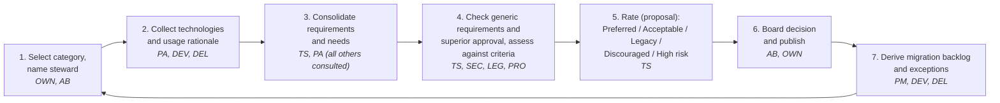
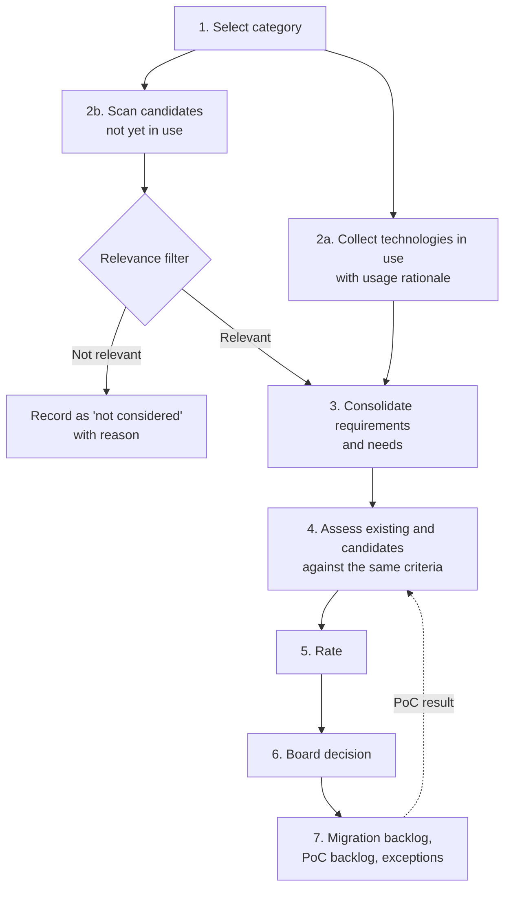
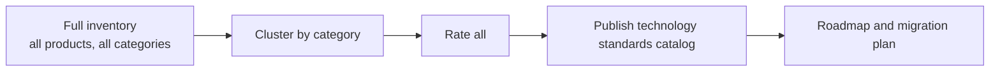
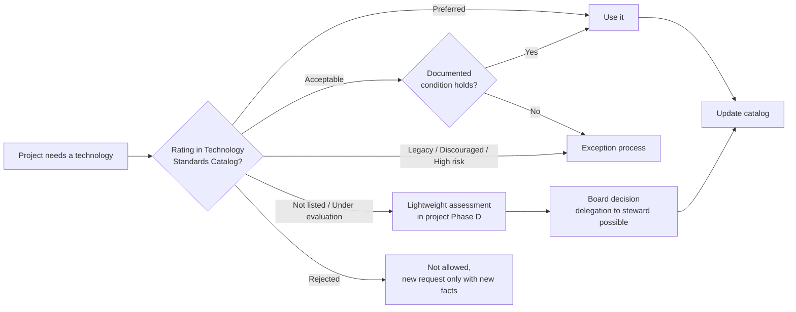
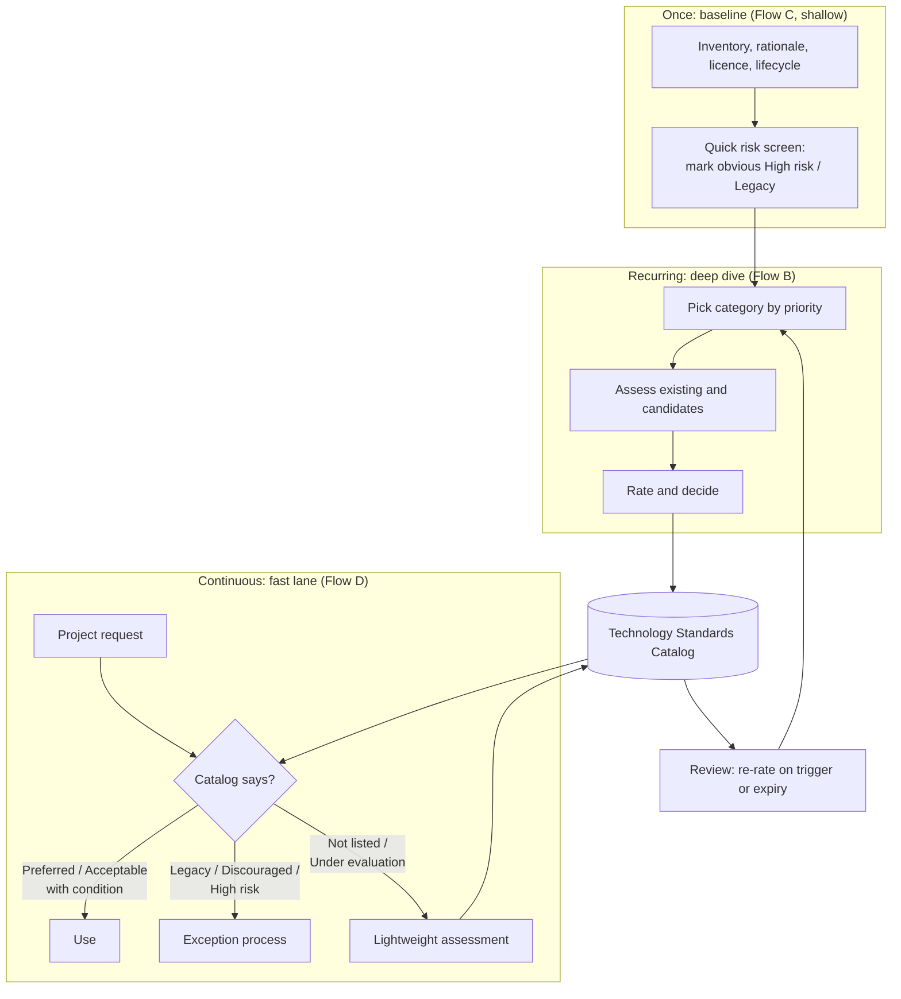
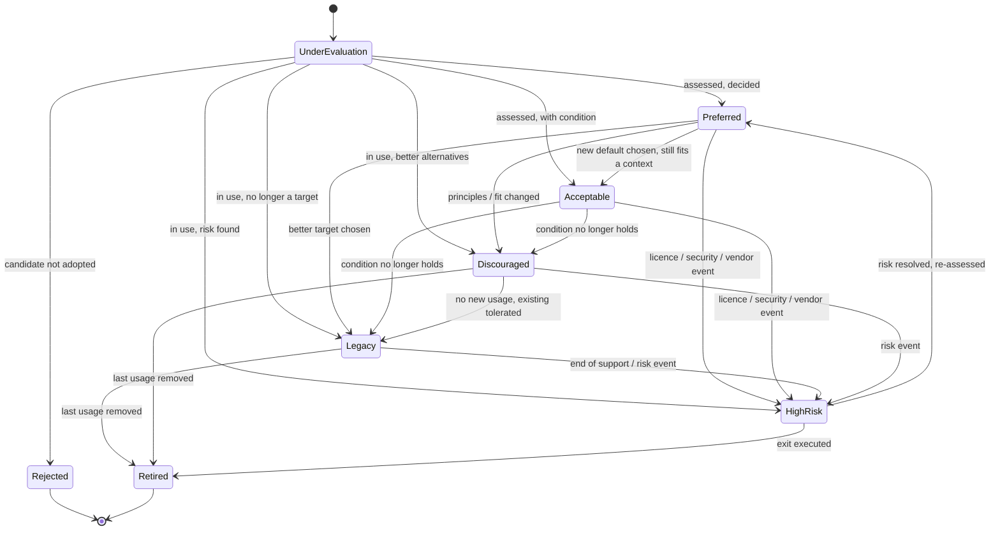
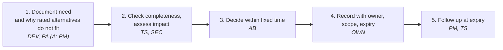
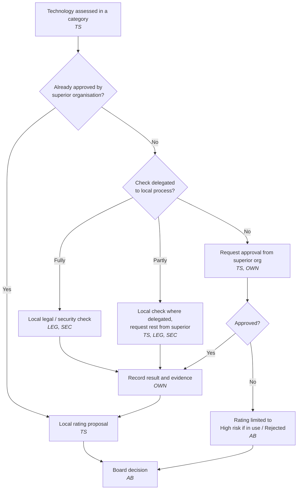

# Technology Harmonization across Products

!!! note "Status: Draft / proposal"
    This chapter is a planning document. It proposes processes, it does not yet describe an established practice.

!!! info "Made with Claude"
    This chapter was drafted with the help of Claude (AI assistant by Anthropic) and then reviewed and decided on by the author. Sources were checked as far as stated in the [source list](#sources); verify citations before relying on them.

## Goal

Several products grow over time and each team picks its own libraries, frameworks, databases, engines and platforms.
Some of this diversity is useful, most of it is accidental and costs money: more skills to maintain, more licences, more security patching, and harder staffing across teams.

The goal is to **harmonize software components over products** in a controlled, transparent way:

* Know which technologies are in use, where, and why.
* Make a deliberate, documented decision per technology.
* Give new projects a clear default ("paved road") without blocking justified exceptions.
* Keep the decisions alive, because technology and licences change.

## Standards this builds on

Nothing here is new. The flows are assembled from established building blocks:

| Standard | What is reused | Source |
|---|---|---|
| TOGAF® 10 ADM Phase D (Technology Architecture) | Baseline vs. target technology architecture, gap analysis. Technology Architecture outputs include the Technology Standards catalog and the Technology Portfolio catalog | [1], [2] |
| TOGAF® Technology Portfolio catalog | List of *all technology in use* (hardware, infrastructure software, application software). Typically the start point of the Technology Architecture phase and the foundation for the other matrices and diagrams. This is the inventory of the flows below | [2], [5] |
| TOGAF® Technology Standards catalog | Agreed technology standards with versions, lifecycles and refresh cycles. Also used to identify discrepancies across the enterprise. This is where the ratings below are recorded | [2], [6] |
| TOGAF® Architecture Board | Cross-organisation decision body: basis for decisions on architectures, enforcing compliance, granting dispensations (= exceptions here), recommended four to five and no more than ten permanent members | [3] |
| TOGAF® Architecture Compliance | Reviewing that projects conform to the agreed architecture and standards | [4] |
| TOGAF® Phase E/F and Phase G/H, Principles, Requirements Management | Migration planning, governance, change management, criteria for rating | [1] (names only, content not individually verified) |
| Gartner TIME model: Tolerate, Invest, Migrate, Eliminate | Inspiration only. TIME rates **applications** on *business value* × *technical fit*; it is not defined for technologies. The rating scale below is a technology-level analogue, not a mapping | [7] |
| Thoughtworks Technology Radar: Adopt, Trial, Assess, Hold | Rings for communicating the result. *Hold* means "don't start anything new with this, no harm in existing projects", which corresponds closely to *Legacy*/*Discouraged* below. *Assess* corresponds to *Under evaluation*, *Adopt* to *Preferred*. *Trial* has no direct equivalent (closest: a proof of concept, or *Acceptable* with the *Transition* condition) | [8] |
| ISO/IEC 25010 | Product quality characteristics as a checklist for the quality criteria (see [Architecture Rating](ISAQB-CPSA/10-architecture-rating.md)) | [9] |
| arc42 section 10 (Quality Requirements) | Format for making quality requirements specific and measurable | [10] |
| SPDX | Standardised licence identifiers for the `Licence` field of the inventory | [11] |
| SBOM formats (SPDX, CycloneDX) | Machine-readable list of the components of a product, used to generate and check the inventory automatically | [11], [13] |
| ITIL 4 (continual improvement, change enablement) | Idea for the review cycle. Not verified against the publication | not verified |

## Building blocks shared by all flows

### Generic requirements (apply to every technology)

Before any category-specific assessment, every technology must pass the **generic requirements**. They apply to all categories and are defined once by the architecture board, not per cycle. A technology failing a generic requirement cannot be rated *Preferred* or *Acceptable*: if it is in use it is rated *High risk* (with the failed requirement as risk type), a candidate not in use is *Rejected*.

Examples of what belongs here (the concrete content is the organisation's decision):

* Permitted and forbidden open source licence families (for example "no strong copyleft in distributed products").
* **Deployment constraints**, including on-premise: runs without internet access, no mandatory SaaS dependency, supported on customer-provided platforms.
* Minimum security and support expectations (maintained, security fixes available).
* Compliance obligations that hold for all products.

Requirements of the superior organisation (see [Embedding](#embedding-in-the-technology-approval-process-of-the-superior-organisation)) are inherited here. This chapter's generic requirements may be stricter than the superior ones, never weaker.

Customer-mandated or on-premise constraints are part of this list, not a separate mechanism. The *licence assessment itself* (how a licence is analysed and classified) is **not defined in this flow**. The flow only consumes its result as a pass/fail input to the generic requirements.

### Technology categories ("types")

Technologies are always assessed per **category**, never as one flat list. Comparing a message broker with a UI framework is meaningless.

The set of categories is **open-ended and configured per use case**. There is no fixed or complete list. Typical examples:

* Databases (relational, document, search, time series)
* Key-value stores and caches
* Runtimes and programming languages
* UI frameworks
* Messaging and integration
* Workflow and process engines (see [Workflow Engines](../technologies/Workflow-Engines/index.md))
* Identity and access
* Observability
* Build, CI/CD and packaging
* Runtime platforms (containers, orchestration, cloud services)

**Defining a category.** A category is created when someone starts the process for it (a product architect or the board requests it). The definition is short: name, scope (what is in, what is out), and the steward. Overlapping categories are avoided by scope statements; a technology belongs to exactly one category, additional uses are noted in the inventory.

**Order.** The order is not fixed. It follows the priority score from Flow E (products affected × risk × cost) and is decided by the board when planning cycles. A category is also started on demand, for example when a project needs a decision in a category that has no ratings yet.

### What counts as a technology (granularity)

Not every dependency is rated individually. A product easily has hundreds of (transitive) libraries; rating each one would stall the process. Rule of thumb:

* **Rated individually:** technologies that shape the architecture or are expensive to replace: runtimes, frameworks, databases, engines, platforms, and libraries that are used directly and are hard to replace (see *Replaceability* below).
* **Covered by the generic requirements only:** all other libraries, including transitive dependencies. They are not rated, but must pass the generic requirements (licence, security, maintenance). This check should be automated, for example with a software bill of materials (SBOM, in SPDX [11] or CycloneDX [13] format) and dependency scanning in the build.
* **Versions:** a rating applies to a technology and, where it matters, a **version range** (for example "Java 21+ Preferred, Java 8 to 11 Legacy"). Major versions with different support status or licence are rated separately.

Where exactly the line lies is decided per category by the board when the category is defined.

### Inventory record (minimum data per technology and product)

| Field | Description |
|---|---|
| Technology and version | Name, version, vendor or community |
| Category | One of the configured categories |
| Product(s) using it | Link to the product |
| Usage rationale | *Why* is it used? Which requirement or need does it serve? |
| Licence | SPDX identifier, commercial terms, cost |
| Lifecycle | Release date, end of support, community health |
| Technical owner | Person in the product who answers questions about this usage (usually from DEV). Ownership of the category and its ratings is with the steward (TS) |
| Product contacts | The PM, DEV, DEL and PA contact **per product** that uses the technology (see [Contacts per role](#contacts-per-role)) |
| Superior approval | Status of the approval by the superior organisation, and for legal/security checks who performed them, the scope and the date (see [Embedding](#embedding-in-the-technology-approval-process-of-the-superior-organisation)) |
| Replaceability | How deeply is it embedded (library vs. data model vs. platform)? |
| Last confirmed | Date on which the product confirmed the record. Records not confirmed within the review period are flagged as stale |

### Catalog

The inventory records and the confirmed ratings together form the technology catalog (in TOGAF® terms the Technology Portfolio and Technology Standards catalogs, see above). The catalog is stored **in the tool the organisation already uses** (for example Confluence, Git or SharePoint). The process is tool-agnostic and does not require a new tool. Manually maintained inventories go out of date quickly, so wherever possible the usage data is generated from the build (SBOM, dependency manifests) and only the rationale, contacts and ratings are maintained by hand. For the options and their trade-offs see [Architecture Repository](Content-Framework/Documents/arch-repository.md).

### Rating scale

A rating is a **decision aid, not a decision**. The technology steward proposes a rating based on the assessment, and it helps the architecture board to decide. The **final decision is always made by the board**. Once the board has confirmed a rating, it is **binding for all products**: the consequences in the table below apply, and deviations are only possible through the exception process, which the board decides as well.

The scale, with a precise definition so that ratings stay comparable:

| Rating (proposal, then confirmed by the board) | Meaning | New usage (new products **and** new components in existing products) | Existing usage |
|---|---|---|---|
| **Preferred** | Default choice. Passes generic requirements, supported, skills available, fits principles | Use by default | Keep |
| **Acceptable** | Good in a defined context, but not the default (conditions below) | Allowed only if a documented condition holds | Keep while the condition holds |
| **Legacy** | Still supported, but no longer a target | Not allowed without exception | Keep, migrate at natural opportunity |
| **Discouraged** | Works, but better alternatives exist or it conflicts with principles | Not allowed without exception | Plan migration |
| **High risk** | Licence, security, vendor, end-of-life or compliance risk | Forbidden. Exceptions only with a documented mitigation and with SEC/LEG consulted | Mitigation or exit plan with deadline |

In addition, these **states** are not ratings but are recorded in the catalog:

| State | Meaning | New usage | Existing usage |
|---|---|---|---|
| **Under evaluation** | Not yet assessed, or assessment or superior approval pending | Request assessment first (fast lane, Flow D); not allowed while superior approval is pending | Keep, schedule assessment (and submit to superior approval if not yet approved) |
| **Rejected** | Assessed and not adopted (candidate, or failed generic requirements before any use) | Not allowed; a new request needs new facts | not applicable |
| **Retired** | Last usage removed from all products | Not allowed | not applicable |

The column "New usage" deliberately covers existing products too: adding a *Discouraged* technology to a new component of an existing product is new usage, not existing usage.

**One default per scope.** Within a category (or a clearly scoped part of it, for example "relational databases") there is normally **one** *Preferred* technology. If two are needed, either the scope is split, or the second one is *Acceptable* with its condition.

**When is a technology *Acceptable* (and not Preferred)?** Every *Acceptable* rating must state its conditions in the catalog. A technology is only rated *Acceptable* if it passes the generic requirements **and** at least one of these applies. The conditions are written into the rating, for example:

* **Context-specific fit:** it is the better choice for a clearly bounded use case (for example a search engine for full-text search while a relational database is Preferred for general data).
* **Preferred option does not cover a documented requirement:** the Preferred technology fails a specific, recorded requirement of the product.
* **Transition:** it is the planned target or a stepping stone for a migration and not yet fully rolled out.
* **Platform constraint:** a platform, partner or customer environment prescribes it (and the generic requirements are still met).

Not valid reasons: personal preference, team familiarity alone, or "we already started". Familiarity may be noted but does not justify *Acceptable* on its own. *Acceptable* is reviewed at the normal review date and drops to *Discouraged* or *Legacy* when its condition no longer holds.

Notes:

* *Legacy* and *Discouraged* are deliberately different. Legacy is a lifecycle statement ("was fine, is aging"), Discouraged is a judgement ("we would not choose it").
* *High risk* must always name the **risk type** (licence, security, vendor lock-in, end of support, compliance) so mitigation can be targeted.
* Every rating carries a **review date**. A rating without expiry rots.
* An **exception process** is mandatory because ratings are binding (see the Architecture Contract and Change Request documents in the [Content Framework](Content-Framework/index.md)). Exceptions are decided by the architecture board only, are limited in scope and time, and are recorded in the catalog. A local exception can never override a rejection or a requirement of the superior organisation (see [Embedding](#embedding-in-the-technology-approval-process-of-the-superior-organisation)).

### Rating criteria (for the "requirements and needs are checked" step)

1. **Functional fit**: covers the collected requirements and needs.
2. **Quality attributes**: performance, security, operability, scalability, maintainability.
3. **Cost**: total cost of ownership. Licence compliance is a generic requirement (a pre-condition), not weighed here.
4. **Vendor and community health**: release cadence, bus factor, roadmap, support options.
5. **Skills**: available in the organisation and on the labour market.
6. **Integration**: fit with the existing stack and with the architecture principles.
7. **Exit cost**: how hard is it to leave again?

Weight the criteria per category. Document the weights once per category, **before** the first assessment (in step 3 of the cycle), not per assessment. Weights fixed after the scores are known invite tuning towards a favourite.

The roles used in the flows (TS, PM, DEV, DEL, AB, ...) are defined in [Roles](#roles) at the end of this chapter, together with a [RACI](#raci-generic).

---

## Flow A: Category-by-category cycle (inventory → assess → decide)

The basic cycle. One category at a time is run through the full loop, and **only technologies that are already in use** are in scope.

Roles are shown in italics below each step (abbreviations: see [Roles](#roles)). Only the roles named in a step are involved.

| Step | Result | A (accountable) | R (responsible) | C (consulted) | TOGAF® reference |
|---|---|---|---|---|---|
| 1. Select category | Category definition, named steward, priority (by cost, risk or pain) | AB | OWN | PM, PA | Preliminary, Phase A |
| 2. Collect | Inventory records for all products | TS | PA, DEV | DEL, PM | Phase D baseline |
| 3. Consolidate | Requirement list per category, with product-specific needs flagged | TS | TS, PA | all other roles (OWN, PM, DEV, DEL, AB, SEC, LEG, PRO) | Requirements Management |
| 4. Assess | Pass/fail of generic requirements and superior approval status, scoring per criterion, rationale documented | TS | TS | PM, DEV, DEL, PA, SEC, LEG, PRO | Phase D gap analysis |
| 5. Rate | Rating proposal per technology plus risk type | TS | TS | PA, PM, DEV, DEL | Technology Standards catalog |
| 6. Decide | Decision record, published catalog | AB | AB, OWN (publish) | TS, PM, SEC, LEG, PA | Architecture Board |
| 7. Derive | Migration candidates, exceptions, owners | PM | DEV, DEL | TS, PA | Phase E/F |

**Pros**

* Small, finishable scope per cycle, visible results early.
* Requirements are known before anything is rated, so ratings are evidence based.
* Learning effect: the second category goes faster than the first.
* Fits a limited architecture capacity (one steward, one category).

**Cons**

* Only existing technologies are judged. A better alternative nobody uses yet is never considered, so the result can cement the status quo.
* Can pick a "best of the bad" technology as Preferred.
* Cross-category dependencies (for example a framework that dictates the database driver) are seen late.
* Landscape-wide picture takes many cycles.

**Mitigation:** Add horizon scanning as step 2b, which is Flow B (see below).

---

## Flow B: Category cycle with horizon scanning (existing + candidates)

Same as Flow A, but each cycle also looks at **technologies not yet in use** which are relevant for the category.

**Keeping scope under control (the scope-creep guard):**

* **Relevance filter** with hard entry criteria. A candidate is only assessed if at least one holds:
    * it is requested by a product team for a concrete need,
    * it is a recognised leader or successor in the category (radar, analyst reports, community standard),
    * it solves a documented problem of a technology currently in use (cost, risk, end of life).
* **Cap** the number of candidates per cycle (for example max. 3 to 5).
* **Time-box** the scan (for example 2 weeks) and the whole cycle (for example 6 to 8 weeks).
* Candidates get a lighter first assessment. Only candidates passing a go/no-go move to a **proof of concept**; the PoC is a separate, scheduled work item, not part of the cycle.
* New technologies start as **Under evaluation** (radar ring *Assess*), never directly as *Preferred*. A candidate that needs a PoC stays *Under evaluation* until the PoC result has been assessed in the next cycle (dotted line above). Candidates that are assessed and not adopted are recorded as *Rejected* with the reason, so the same discussion is not repeated.

**Roles added compared to Flow A:**

| Step | A | R | C | Note |
|---|---|---|---|---|
| 2b. Scan candidates | TS | TS | DEV, PA, SEC, PRO | Each candidate gets an advocate (usually DEV) and a critic (usually SEC or PA) |
| Relevance filter | TS | TS | PM, PA | Entry criteria applied by the steward, borderline cases to the board |
| Proof of concept (separate work item) | TS | DEV | DEL, SEC, PA | Scheduled by PM, not part of the cycle time-box |

All other steps as in Flow A.

**Pros**

* Avoids cementing the status quo, finds better targets for the Legacy/Discouraged items.
* Rating of existing technology is calibrated against real alternatives.
* Supports a defensible decision ("we looked at alternatives X and Y").

**Cons**

* More effort per cycle, higher risk of scope creep without the guard above.
* Needs people with market knowledge, not only product knowledge.
* Risk of "shiny object" bias; candidates need an advocate *and* a critic.

---

## Flow C: Landscape-wide assessment ("all technology at once")

All categories are inventoried and rated in one program.

**Roles:** this is a programme, not a recurring cycle.

| Step | A | R | C |
|---|---|---|---|
| Programme set-up, categories clustered | AB | OWN | TS (all appointed up front), PM |
| Full inventory | OWN | PA, DEV | DEL, PM |
| Shallow rating and risk screen | AB | TS (per category) | SEC, LEG, PRO |
| Publish catalog and roadmap | OWN | OWN, TS | PM, DEL, AB |

Because all stewards work in parallel, the board and the architecture office are the bottleneck.

**Pros**

* Complete picture, cross-category dependencies visible.
* One consistent decision round, one communication moment.
* Good fit after a merger or acquisition, or before a platform strategy.
* Strong basis for a business case (total cost, licence exposure).

**Cons**

* High scope-creep risk, long time to first result, value only at the end.
* Heavy load on product teams for data collection in one burst.
* Data quality drops with volume; ratings become shallow.
* Stakeholder fatigue and decision backlog at the board.
* Everything is a snapshot that is outdated when finished.

**When it is justified:** a one-off *baseline* for a cheap, shallow first pass (inventory and risk screening only), followed by Flow A/B for depth. See Flow E.

---

## Flow D: Product-driven (demand-led) assessment

No up-front cycle. Technology choices are checked **when a project or product needs one** (new product, major release, new component). This is the classic TOGAF® project-level flow: Phase D of the project feeds the catalog.

In the fast lane "Preferred, use it" is not a decision of the rating itself. It applies because the board has already confirmed that rating and thereby decided the standard case in advance. The same holds for *Acceptable* when the product architect (PA) confirms that the documented condition holds; the usage and the condition are recorded in the catalog. Legacy, Discouraged and High risk go to the [exception process](#supporting-flow-exception-handling), not to a new assessment. Everything else needs a board decision. If the technology is not yet approved by the superior organisation, its lead time applies as well (see [Embedding](#embedding-in-the-technology-approval-process-of-the-superior-organisation)).

**Roles:** only a few roles are needed. The fast lane skips DEL, PRO and LEG unless the request touches them.

| Step | A | R | C | I |
|---|---|---|---|---|
| Project states the need | PM | DEV, PA | TS | |
| Lookup in catalog, Preferred (or Acceptable with condition): use it | PM | DEV, PA | | TS |
| Lightweight assessment | TS | TS | PA, SEC, DEL (operability) | PM, DEV |
| Decision (or delegated to TS for low-impact cases) | AB | AB (TS if delegated) | TS, PM | DEV, OWN |
| Update catalog | OWN | OWN, TS | | AB |

**Pros**

* Lowest overhead, effort is only spent where a decision is actually needed.
* Decisions are made with concrete requirements and context.
* Naturally keeps the catalog relevant to real demand.

**Cons**

* Reactive: existing sprawl is never cleaned up on its own.
* Inconsistent depth, depends on the individual project architect.
* Risk of the "decision by whoever shouts first", local optimisation.
* Needs an initial catalog, otherwise there is no reference.

---

## Flow E: Hybrid (recommended starting point)

Combine a shallow landscape-wide baseline with deep category cycles and a demand-led fast lane. Each flow covers the weakness of another.

Priorities for the deep dives can be driven by a simple score: **number of products affected × risk × cost**. Start where the pain is largest, not where the category list begins.

**Initial catalog.** After the baseline almost everything is *Under evaluation*, so the fast lane would send every request to an assessment. To avoid this, the board confirms the baseline result in **one batch decision**: obvious *High risk* and *Legacy* marks are confirmed, and technologies that are in use without findings stay *Under evaluation* with existing usage allowed. Technologies found in the baseline without superior approval are submitted to it; a *Legacy* mark is only confirmed once the superior organisation has approved it. Repeated fast-lane requests in a category raise its priority for a deep dive.

**Roles per mechanism:**

| Mechanism | A | R | C | Roles *not* involved |
|---|---|---|---|---|
| Baseline (Flow C, shallow) | OWN | PA, DEV | TS, SEC, LEG, DEL | PRO, PM (informed only) |
| Deep dive (Flow B) | AB | TS | PM, DEV, DEL, PA, SEC, LEG, PRO | none, this is the full flow |
| Fast lane (Flow D) | AB | TS | PA, DEV | LEG, PRO (only if relevant), DEL (only for operability) |

**Pros**

* Early value: the baseline surfaces the worst risks (for example licence issues) within weeks.
* Deep, evidence-based ratings where it matters, bounded scope per cycle.
* Projects are rarely blocked: the fast lane answers within days (unless a superior approval is needed, which has its own lead time).
* Self-correcting: fast lane decisions feed the catalog, expiry dates trigger re-rating.

**Cons**

* Three mechanisms to run and explain; needs clear governance.
* Baseline data will be rough and must be improved in the cycles.
* Needs discipline that fast lane decisions really flow back into the catalog.

---

## Supporting flow: Review and re-rating (lifecycle)

Ratings must change when the world changes. Triggers:

* Review date expired (for example every 12 months, 6 months for *High risk*).
* Licence change of the vendor, acquisition, or end-of-support announcement.
* Critical vulnerability or repeated security incidents.
* New product requirement which the current rating did not consider.
* Superior approval revoked, narrowed or newly granted.
* Last usage removed (migrations completed in **all** products): state changes to *Retired*.

| Trigger | Detected by (R) | Accountable | Decides |
|---|---|---|---|
| Review date expired | OWN | TS | AB (on proposal) |
| Licence change, acquisition, end of support | LEG, PRO, TS | TS | AB |
| Critical vulnerability or repeated incidents | SEC, DEL | TS | AB |
| Superior approval changed | OWN, SUP-AB | TS | AB |
| New product requirement not covered by the rating | PM, DEV, PA | TS | AB |
| Last usage removed (each product reports its completed migration) | DEV, DEL, PA | TS | TS updates the state to *Retired*, AB informed |

The diagram shows the usual transitions, not every allowed one. Any change of rating is a board decision, except *Retired*, which is a fact recorded by the steward.

## Supporting flow: Exception handling

An exception (a *dispensation* in TOGAF® terms, granted by the Architecture Board [3]) is the only way to deviate from a binding rating.

1. Team documents need and why the rated alternatives do not fit. PM is accountable that the need is real, DEV and PA prepare it.
2. Steward checks completeness and impact (SEC is consulted when risk is involved, LEG for licence or compliance topics).
3. The architecture board decides within a fixed time (for example 5 working days). If the time is exceeded, OWN escalates to the board chair; there is **no implicit approval**. A rejected request is recorded with its reason; the product uses a rated alternative.
4. An approved exception is recorded with owner, scope, conditions and **expiry date** by the architecture office.
5. At expiry the product either has migrated or requests a renewal. An expired exception without renewal is a compliance finding (see [Compliance check](#supporting-flow-compliance-check)). Repeated exceptions for the same need are a signal to re-assess the category.

Limits: an exception cannot grant what the superior organisation has rejected or what its inherited requirements forbid. Such cases go to the superior organisation.

Roles not involved by default: DEL, PRO, LEG (consulted only when the exception touches their area).

## Supporting flow: Compliance check

Binding ratings only work if deviations are noticed. The compliance check (TOGAF® Architecture Compliance [4], documented as a [Compliance Assessment](Content-Framework/Documents/compliance-assessment.md)) compares each product with the catalog.

* **When:** continuously where automated (SBOM and dependency scan in the build against the catalog), otherwise at major releases and at least once per review period.
* **What:** new usage of technologies that are not *Preferred* or *Acceptable* without an exception; *Acceptable* usage whose condition no longer holds; expired exceptions; overdue migration or exit plans for *High risk*.
* **Who:** PA performs the check for their product (R), OWN is accountable that it happens and reports the results to the board.
* **Outcome:** a finding is fixed by the product (migration, removal) or turned into an exception request. Unresolved findings are escalated by OWN to the board. Findings are input for the review of the category.

## Embedding in the technology approval process of the superior organisation

The process in this chapter works at the level of a **product landscape** (a set of products). The superior organisation (group, enterprise) usually has its own technology approval process, with its own legal, security and architecture checks. Both must fit together without doing the same work twice and without contradicting each other.

TOGAF® describes architecture boards that operate at several levels, local (domain experts) and global (organisation-wide responsibility) [3]. The board of this chapter is the local one; the superior approval body is the global one. The rating and the approval answer different questions:

| | Superior approval | Rating in this chapter |
|---|---|---|
| Question | "May this technology be used in the organisation at all?" | "Which of the approved technologies do we use, and how?" |
| Result | Approved / not approved (possibly with conditions) | Preferred / Acceptable / Legacy / Discouraged / High risk |
| Scope | Whole organisation | The product landscape |
| Owner | Superior architecture, legal, security | Local architecture board |

**Rule:** every technology that is not yet approved by the superior organisation **must be submitted to the superior approval**, including technologies that are already in use. There is no local shortcut. A technology can only be rated *Preferred*, *Acceptable*, *Legacy* or *Discouraged* if the superior approval is *approved* (an approval may be limited, for example to existing use only, which fits *Legacy*). Conditions of the superior approval are taken over into the local rating. A local rating or exception never overrides a rejection by the superior organisation. A technology that is *not approved* is:

* *Under evaluation* while the superior approval is pending (existing usage continues, new usage is not allowed),
* *High risk* (risk type compliance) if it is in use and was rejected, with an exit plan,
* *Rejected* if it is not in use and was rejected.

### Embedding variants

The right variant depends on how the superior process is organised. The variant is chosen once and written into the generic requirements.

| Variant | How it works | Pros | Cons |
|---|---|---|---|
| **1. Superior list as input (pre-approved catalog)** | The superior list of approved technologies is an input. The local process only chooses among approved technologies | Clear, no double work | Candidates not on the list need a request to the superior organisation first, which can be slow |
| **2. Gate before rating (sequential)** | The local assessment proposes a rating, then the superior approval is requested for technologies not yet approved. The board decides after the approval | Superior sees a prepared, evidence-based request | Longest lead time |
| **3. In parallel** | The superior check and the local assessment run at the same time, the board decides when both are ready | Shortest lead time | Wasted work if the superior organisation rejects; needs good coordination |
| **4. Delegated checks** | The superior organisation delegates the legal and/or security check to this process (see below). Approval remains with the superior organisation or is delegated as a whole for defined cases | Fast, uses local knowledge | Needs trust, clear scope and audit |

Variants can be combined, for example variant 1 for common technologies and variant 4 for the legal check of low-risk libraries.

### Delegating the legal and security check

The superior organisation may delegate the legal (licence, compliance) and/or the security check of technologies to this local process. The delegation is not implicit; it is agreed in writing between the superior approval body and the local architecture board. The following should be part of the agreement:

| Item | Content |
|---|---|
| Scope | Which checks (legal, security, or both), for which technology classes or risk levels (for example "libraries with a permissive licence", not "databases") |
| Criteria | Which checklist or method applies. The local process **uses the superior criteria**; this flow does not define the licence assessment method itself |
| Who performs it | The local LEG and SEC roles, or named delegates. If the local organisation has no such roles, the delegation is not possible for that check |
| Evidence | What is recorded per technology: result, method/checklist version, person, date, scope. Stored in the catalog (field *Superior approval*) |
| Exclusions | Cases that always go back to the superior organisation, for example copyleft or unclear licences, critical security findings, commercial contracts, personal data |
| Escalation | A check that cannot be concluded locally, or any doubt, is escalated to the superior body |
| Oversight | The superior organisation can sample the delegated checks, receives a regular report, and can narrow or revoke the delegation |
| Accountability | Remains with the delegating superior body for the organisation-wide approval; the local board is accountable for performing the delegated check correctly |
| Review | The delegation itself has a review date (for example yearly) |

Without a delegation, the legal and security checks are always requested from the superior organisation, and the local process waits for the result.

### Roles at the interface

| Abbr. | External role | Task |
|---|---|---|
| **SUP-AB** | Superior approval body (global architecture board or equivalent) | Approves technologies organisation-wide, defines or grants delegations |
| **SUP-LEG** | Superior legal / compliance | Performs or delegates legal checks, defines criteria |
| **SUP-SEC** | Superior security | Performs or delegates security checks, defines criteria |

Interface RACI (only the activities that cross the boundary):

| Activity | OWN | TS | AB | LEG | SEC | SUP-AB | SUP-LEG | SUP-SEC |
|---|---|---|---|---|---|---|---|---|
| Choose the embedding variant, accept a delegation | R | C | A | C | C | C | C | C |
| Grant a delegation | I | | C | C | C | A/R | C | C |
| Request superior approval for a technology | R | A | I | C | C | I | | |
| Decide superior approval | | I | I | | | A/R | C | C |
| Perform delegated legal check | I | C | I | A/R | | I | C | |
| Perform delegated security check | I | C | I | | A/R | I | | C |
| Report on delegated checks | R | C | A | R | R | I | I | I |
| Revoke or narrow a delegation | | | C | | | A/R | C | C |

The delegation is agreed between both boards, split into two rows so that each row keeps a single accountable role: the superior body is accountable for granting it, the local board for accepting and complying with it.

## Comparison of flows

| Criterion | A: Category cycle | B: + Horizon scan | C: All at once | D: Demand-led | E: Hybrid |
|---|---|---|---|---|---|
| Time to first result | Medium | Medium to long | Long | Short | Short |
| Depth of assessment | High | High | Low to medium | Varies | High where it matters |
| Considers technologies not yet in use | No | Yes | Rarely | Only ad hoc | Yes |
| Scope-creep risk | Low | Medium (guarded) | High | Low | Medium |
| Effort on product teams | Medium | Medium | High (burst) | Low | Medium, spread out |
| Cleans up existing sprawl | Yes, step by step | Yes | Yes, via roadmap | No | Yes |
| Cross-category view | Weak | Weak | Strong | None | Medium (baseline) |
| Governance complexity | Low | Medium | Medium | Low | Higher |
| Fits small architecture team | Yes | Partly | No | Yes | Partly |

## Recommendation

1. Start with **Flow E**, but keep the baseline shallow (inventory and obvious risks only).
2. Run the first deep dive as **Flow B** on one category with high pain and few candidates, as a pilot, to calibrate effort, criteria and the rating scale.
3. Run **Flow D** from the start for new projects, fed by the first catalog version.
4. Review the process itself after two cycles.

If architecture capacity is very small, use Flow A plus Flow D and add horizon scanning only when a Legacy/Discouraged rating needs a successor.

## Roles

Abbreviations are used in the flows and the RACI below. **Not every role takes part in every process**; the flow tables list only the roles that are involved, all others are not needed for that step.

| Abbr. | Role | Task in this process |
|---|---|---|
| **TS** | Technology steward (per category) | The one coordinating the assessment. Appointed **when the process for the category is started**. Owns inventory and ratings of the category, prepares assessments and the decision proposal |
| **PM** | Product management | Brings business needs and priorities, owns the product roadmap and therefore the migration decisions of a product. Accountable for exception requests of their product |
| **DEV** | Product development | Provides usage and rationale for the technologies in their product, evaluates candidates, runs proofs of concept, implements migrations |
| **DEL** | Delivery (operations, release, customer deployment) | Brings operational facts: operability, incidents, patching effort, on-premise deployment constraints. Executes rollouts |
| **AB** | Architecture board | TOGAF-style board. Takes the **final decision** on ratings, generic requirements and exceptions (dispensations). Small and time-boxed |
| **PA** | Product architect | Links the product to the process: validates inventory data, brings architecture requirements, checks compliance of the product against the catalog |
| **OWN** | Process owner / architecture office | Owns the process itself, plans cycles, prepares board meetings, maintains and publishes the catalog (catalog custodian) |
| **SEC** | Security | Assesses security aspects of technologies, reports vulnerabilities and security incidents as re-rating triggers |
| **LEG** | Legal and compliance | Owns the licence and compliance rules behind the generic requirements. (The licence assessment method itself is outside this flow) |
| **PRO** | Procurement / vendor management | Brings contract, cost and vendor situation for commercial technologies |

Optional roles, added when needed: **QA / test** (test tooling categories), **Support** (customer-facing impact of technology changes), **Data protection officer** (categories that touch personal data), **Customers or partners** as source of external constraints (represented through PM, never directly decision making).

The steward proposes, the board decides. The steward does not decide alone, and the board does not prepare assessments.

### Contacts per role

Many different products take part, so the same role is typically held by **different people for different products**. The process must not assume one person per role.

| Role | Cardinality | Consequence |
|---|---|---|
| PM, DEV, DEL, PA | **One or more contacts per product** | Every product that uses a technology in the category names its own contacts. The steward collects the contacts together with the inventory (field *Product contacts*) |
| TS | One per category (may be several for a large category) | Named when the category process is started |
| SEC, LEG, PRO | One central contact or team, possibly with product-specific delegates | Central contact is the default |
| OWN, AB | Central | One team / one board |

Rules for working with several contacts:

* **"Consulted" means all affected product contacts are asked**, not just one. The steward defines the circle: all contacts of products that use a technology in the category, plus contacts of products which plan to.
* **Consolidate a product's view.** Each product answers once (PM, DEV, DEL and PA of one product align internally), so answers are not contradictory within a product. The product architect (PA) is the default single voice of a product in the process, unless the product has agreed otherwise.
* **Time-box the consultation** (for example 2 weeks) and state in the invitation what happens without an answer. Proposal: no answer within the period means no objection, but it is recorded and the contact is informed of the result.
* **Responsible with several contacts** (for example PA in the RACI row for the inventory): every product's PA is responsible for *their* product's data. The steward is accountable for completeness.
* **Accountable stays single.** In each RACI row exactly one role is accountable for the result, as before; several contacts may only be responsible or consulted. If a product-level accountability exists (PM for migration), it is accountable for *its own product* only.
* **Contact data lives in the catalog** (or is linked from it) and is reviewed with the normal review date, because people change roles.
* **Conflicts between products** (one product needs a technology, another wants it phased out) are not solved by the steward but brought to the board by the steward with the facts of both sides.

## RACI (generic)

R = responsible (does the work), A = accountable (one per row, owns the result), C = consulted, I = informed, blank = not involved. This is the default; the board may adapt it to the organisation.

| Activity | OWN | TS | PM | DEV | DEL | PA | AB | SEC | LEG | PRO |
|---|---|---|---|---|---|---|---|---|---|---|
| Maintain the process itself | A/R | C | C | | C | C | C | | | |
| Draft and maintain generic requirements | R | C | C | | C | C | A | R | R | C |
| Prioritise categories, define category, appoint steward | R | I | C | | | C | A | | | |
| Provide inventory data per product | I | A | C | R | C | R | | | | |
| Consolidate requirements and needs | C | A/R | C | C | C | R | C | C | C | C |
| Scan candidates not yet in use (Flow B) | | A/R | I | C | | C | | C | C | C |
| Assess against generic requirements and criteria | | A/R | C | C | C | C | I | C | C | C |
| Proof of concept | | A | I | R | C | C | | C | | |
| Prepare rating proposal | | A/R | C | C | C | C | I | | | |
| **Decide rating** | I | C | C | I | I | C | A/R | C | C | |
| Publish catalog | A/R | R | I | I | I | I | I | | | |
| Plan migration or exit | | C | A | R | R | C | I | | | |
| Fast lane: request a technology decision (Flow D) | | C | A | R | C | R | I | | | |
| Fast lane: decide on request | I | C (R if delegated) | I | I | | C | A/R | C | | |
| Request an exception | | C | A | R | | C | I | C | | |
| **Decide an exception** | I | C | C | I | I | C | A/R | C | C | |
| Check product compliance against the catalog | A | C | I | C | C | R | I | | | |
| Confirm *Acceptable* condition for new usage (fast lane) | | I | A | C | | R | | | | |
| Trigger re-rating (expiry, vulnerability, licence event, new requirement) | R | A/R | R | R | R | R | I | R | R | R |

Notes:

* The board stays small. Decisions in the fast lane may be **delegated** by the board to the steward for low-impact cases (for example a library inside a Preferred framework). The delegation rule is set by the board, the decision remains a board decision taken on its behalf and is recorded as such.
* PM is accountable for migrations and exceptions because they own the product's priorities and budget. Delivering the change is DEV and DEL.

## Sources

1. The Open Group: [TOGAF® Standard (10th Edition), ADM – Phase D: Technology Architecture](https://pubs.opengroup.org/togaf-standard/adm/chap08.html)
2. The Open Group: [TOGAF® Standard (10th Edition), Architecture Content](https://pubs.opengroup.org/togaf-standard/architecture-content/index.html)
3. The Open Group: [TOGAF® Standard (10th Edition), EA Capability and Governance – Architecture Board](https://pubs.opengroup.org/togaf-standard/ea-capability-and-governance/chap04.html)
4. The Open Group: [TOGAF® Standard (10th Edition), EA Capability and Governance – Architecture Compliance](https://pubs.opengroup.org/togaf-standard/ea-capability-and-governance/chap06.html)
5. The Open Group: [Artifact: Technology Portfolio Catalog](https://pubs.opengroup.org/architecture/togaf90-doc/epf/TOGAF9/workproducts/Technology%20Portfolio%20Catalog_1B13325D.html) (TOGAF 9.0 work product, quoted for wording only)
6. The Open Group: [Artifact: Technology Standards Catalog](https://pubs.opengroup.org/architecture/togaf90-doc/epf/TOGAF9/workproducts/Technology%20Standards%20Catalog_D8B8157.html) (TOGAF 9.0 work product, quoted for wording only)
7. LeanIX: [Gartner TIME model](https://www.leanix.net/en/wiki/ea/gartner-time-model) (secondary source for Gartner's TIME framework)
8. Thoughtworks: [Build your own Technology Radar](https://www.thoughtworks.com/en-de/insights/blog/build-your-own-technology-radar)
9. arc42 Quality Model: [ISO/IEC 25010](https://quality.arc42.org/standards/iso-25010); standard itself: ISO/IEC 25010:2023
10. arc42: [Section 10 – Quality Requirements](https://docs.arc42.org/section-10/)
11. SPDX: [Handling licence information / SPDX licence identifiers](https://spdx.dev/learn/handling-license-info/)
12. The Open Group: [TOGAF® Series Guide: Architecture Skills Framework](https://pubs.opengroup.org/togaf-standard/architecture-skills-framework/) (title only checked; the roles in this chapter are adapted to product organisations and not taken from it)
13. OWASP CycloneDX: [CycloneDX Bill of Materials Standard](https://cyclonedx.org/) (SBOM format for the automated inventory and the generic-requirements check of libraries; content not verified, site not reachable when drafting)
