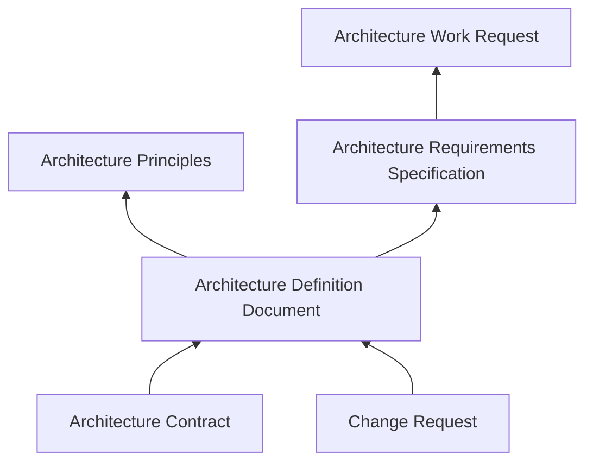
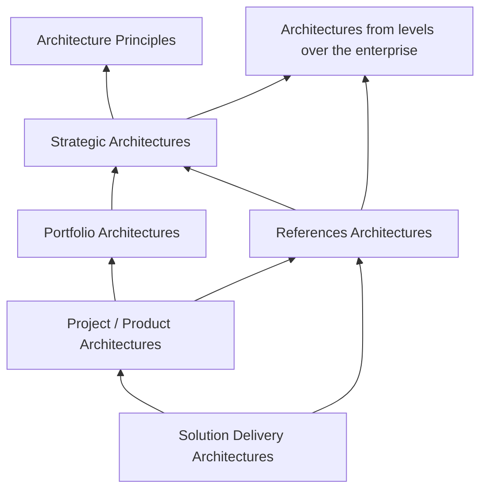

# Overview

If you want to build your own architecture content framework, I can recommend [The TOGAF® Leader's Guide](https://publications.opengroup.org/g168) as a starting point. It can be accessed for free after registration on The Open Group website.

## Scope 

This is not the classic TOGAF like internal enterprise architecture documentation. Instead this is a content framework focussing on software products and services. 
These can be SaaS or on-premise products.

## Structure

Architectures come, as defined by TOGAF standard, in four purposes.

| Purpose Capability | Description | Examples |
| ------- | ------ | ------| 
| Strategy | Architecture projects which scope the overall strategic ideas. These are very specified. | New Product Development, Mergers & Acquisitions, Market Analysis |
| Portfolio | Architecture projects which scope a portfolio of products or services. These are more generalised. | Group of products for the same market, Group of products on same tech stack |
| Projects (or Products) | Architecture projects which scope a single product or service. These are very detailed. Besides the Project which is common for TOGAF structure,  | Single SaaS Product, Single On-Premise Software |
| Solution Delivery | Architecture projects which scope a single solution delivery. These are very technical and detailed. | Single Customer Solution, Single Deployment |

These are the main structure. An architecture project can be in one of these categories. 

High level strategic topics start on a general level. An example here is ¨AI Adoption¨. This is often thought for the complete enterprise. Once it strategic architecture is clear it gets either planned for Portfolion or Project(/Product) level.

## Documents

Here are different documents for different architecture purposes. These documents might have a bit different structure depending on the purpose.

### General for all purposes

These document are also created for a purpose. They therefore exist in every purpose. 

| Document | Description | Phase |
| ------- | ------ | ------|
| [Architecture Work Request](./Documents/arch-work-request.md) | Document to request architecture work | Preliminary |
| [Architecture Vision](./Documents/arch-vision.md) | Document to define architecture vision | A |
| [Architecture Principles](./Documents/arch-principles.md) | Document to define architecture principles | Preliminary |
| [Architecture Contract](./Documents/arch-contract.md) | Document to define architecture contract between architecture team and stakeholders | F |
| [Architecture Requirememts Specification](./Documents/arch-requirements-specification.md) | Document to define architecture requirements specification | Requirements Management |
| [Change Request](./Documents/change-request.md) | Document to request changes to architecture | H |
| [Architecture Definition Document (ADD)](./Documents/arch-definition-document.md) | Main architecture document | B, C, D |

### Strategic Purpose

As strategic projects are very individual the pre defined structure is very limited here.

### Portfolio Purpose

| Document | Description | Phase |
| ------- | ------ | ------|
| [Portfolio Documentation](./Documents/portfolio-documentation.md) | Describing the relation for the portfolio, including all projects / portfolios | B, C, D |

### Project / Product Purpose

| Document | Description | Phase |
| ------- | ------ | ------|
| [Product/Project Documentation](./Documents/product-project-documentation.md) | Special ADD describing the complete product or project | B, C, D |
| [Compliance Assessment](./Documents/compliance-assessment.md) | Document to assess compliance requirements for a product or project | G |

### Solution Delivery Purpose

| Document | Description | Phase |
| ------- | ------ | ------|
| [Infrastructure Sizing and Definition](./Documents/infrastructure-definition.md) | Special ADD describing the infrastructure sizing and definition for a solution delivery | B, C, D |

### Document Relation

Arrows show dependencies between documents.

### Superior Architectures
When working on an architecture project, it is important to understand the superior architectures. These are the architectures from higher levels in the enterprise architecture structure. 

TOGAF doesn´t define the levels over the enterprise, but in practical experience these often exist. Also Reference Architectures need to be considered and are added in this view.

Reference Architecutres might also be used for Strategy or Portfolio architectures directly, but this is less common. 

## Document Storage Structure

## Metadata

