# Overview

If you want to build your own architecture content framework, I can recommend [The TOGAF® Leader's Guide](https://publications.opengroup.org/g168) as a starting point. It can be accessed for free after registration on The Open Group website.

## Scope 

This is not the classic TOGAF like internal enterprise architecture documentation. Instead this is a content framework focussing on software products and services. 
These can be SaaS or on-premise products.

## Structure

Architectures come, as defined by TOGAF standard, in four purposes.

| Purpose Capability | Description | Examples | 
| ------- | ------ | ------| 
| Strategy | Architecture projects which scope the overall strategic ideas. These are very specified. | New Product Development, Mergers & Acquisitions, Market Analysis | 
| Portfolio | Architecture projects which scope a portfolio of products or services. These are more generalised. | Group of products for the same market, Group of products on same tech stack |
| Projects (or Products) | Architecture projects which scope a single product or service. These are very detailed. Besides the Project which is common for TOGAF structure,  | Single SaaS Product, Single On-Premise Software |
| Solution Delivery | Architecture projects which scope a single solution delivery. These are very technical and detailed. | Single Customer Solution, Single Deployment |

These are the main structure. An architecture project can be in one of these categories. 

High level strategic topics start on a general level. An example here is ¨AI Adoption¨. This is often thought for the complete enterprise. Once it strategic architecture is clear it gets either planned for Portfolion or Project(/Product) level.

## Documents

Here are different documents for different architecture purposes. These documents might have a bit different structure depending on the purpose.

### General for all purposes

These document are also created for a purpose. They therefore exist in every purpose. 

| Document | Description | Phase | Required |
| ------- | ------ | ------| --|
| [Architecture Work Request](./Documents/arch-work-request.md) | Document to request architecture work | Preliminary | Yes |
| [Architecture Vision](./Documents/arch-vision.md) | Document to define architecture vision | A | No |
| [Architecture Principles](./Documents/arch-principles.md) | Document to define architecture principles | Preliminary | No |
| [Architecture Contract](./Documents/arch-contract.md) | Document to define architecture contract between architecture team and stakeholders | F | Recommended |
| [Architecture Requirememts Specification](./Documents/arch-requirements-specification.md) | Document to define architecture requirements specification | Requirements Management | Yes |
| [Change Request](./Documents/change-request.md) | Document to request changes to architecture | H | Only if needed |
| [Architecture Definition Document (ADD)](./Documents/arch-definition-document.md) | Main architecture document | B, C, D | Yes |
| [Building Block](./Documents/building-block.md) | Document to define a building block | B, C, D | No |

### Strategic Purpose

As strategic projects are very individual the pre defined structure is very limited here.

### Portfolio Purpose

| Document | Description | Phase | Required |
| ------- | ------ | ------| --|
| [Portfolio Documentation](./Documents/portfolio-documentation.md) | Describing the relation for the portfolio, including all projects / portfolios | B, C, D | No | 

### Project / Product Purpose

| Document | Description | Phase |
| ------- | ------ | ------|
| [Product/Project Documentation](./Documents/product-project-documentation.md) | Special ADD describing the complete product or project | B, C, D |
| [Compliance Assessment](./Documents/compliance-assessment.md) | Document to assess compliance requirements for a product or project | G |

### Solution Delivery Purpose

| Document | Description | Phase |
| ------- | ------ | ------|
| [Infrastructure Sizing and Definition](./Documents/infrastructure-definition.md) | Special ADD describing the infrastructure sizing and definition for a solution delivery | B, C, D |

### Document Relation

Arrows show dependencies between documents.

### Superior Architectures
When working on an architecture project, it is important to understand the superior architectures. These are the architectures from higher levels in the enterprise architecture structure. 

TOGAF doesn´t define the levels over the enterprise, but in practical experience these often exist. Also Reference Architectures need to be considered and are added in this view.

Reference Architecutres might also be used for Strategy or Portfolio architectures directly, but this is less common. 

## Document Storage Structure

File system Structure is displayed in the following table. Each deescription in _italic_ is abstract and will be replaced with the actual name.

| Level | Parent | Name | Kind | Description |
| ------- | ------ | ------| ------| --|
0 | root | Strategy | Folder | Containing all Strategy related arch projects | 
0 | root | Portfolio | Folder | Containing all Portfolio related arch projects |
0 | root | Reference Architecture | Folder | Containing all Reference Architecture related arch projects |
0 | root | _Others_ | Folder | Special folders for Solution Delivery etc. which don't fit in one of the resources| 
| | |  
1 | Portfolio | _Portfolio Name_ | Folder | Containing all Products / Projects for this portfolio |
1 | Strategy | _Strategy Architecture Name_ | Folder | Containing all related documents for this strategy |
1 | Strategy | Principles | File | Containing all enterprise architecture principles |
1 | Reference Architecture | _Reference Architecture Name_ | Folder | Containing all related documents for this reference architecture |
| | |
2 | _Protfolio Name_ | Portfolio Documentation | File | Containing all related documents for this product / project |
2 | _Portfolio Name_ | Product / Project Name | Folder | Containing all related documents for this product / project |
2 | _Portfolio Name_ | Solution Delivery | Folder | Containing all related documents for solution delivery projects | 
2 | _Strategy Architecture Name_ | Documents | File | Containing all related documents for this strategy/project |
2 | _Reference Architecture Name_ | Documents | File | Containing all related documents for this reference architecture |
| | |
3 | _Product / Project Name_ | Documents | File | Containing all related documents for this product / project |
3  | _Product / Project Name_ | _Arch Project_ | Folder | Containing all related documents for this product / project |
3 | _Solution Delivery_ | _Customer Name_ | Folder | Containing all related documents for this customer solution delivery |
| | |
4 | _Customer Name_ | Documents | File | Containing all related documents for this customer solution delivery |
4 | _Arch Project_ | Documents | File | Containing all related documents for this architecture project |

To make the overview a bit easier: here is a graph for this with examples. 

```mermaid
graph TD
    root["📁 Architecture Repository"]
    
    %% Level 0 - Root folders
    root --> strategic["📁 Strategy"]
    root --> portfolio["📁 Portfolio"]
    root --> refarch["📁 Reference Architecture"]
    root --> others["📁 Others<br/>(Solution Delivery, etc.)"]
    
    %% Level 1 - Strategy branch
    strategic --> stratproj["📁 AI-Adoption-2025"]
    strategic --> principles["📄 Principles"]
    
    %% Level 1 - Portfolio branch
    portfolio --> portname["📁 SaaS-Product-Portfolio"]
    
    %% Level 1 - Reference Architecture branch
    refarch --> refname["📁 Microservices-Reference-Architecture"]
    
    %% Level 2 - Portfolio branch
    portname --> portdoc["📄 Portfolio Documentation"]
    portname --> prodproj["📁 Authentication-Service"]
    portname --> soldeliv["📁 Solution Delivery"]
    
    %% Level 2 - Strategy branch
    stratproj --> stratdocs["📄 Documents"]
    
    %% Level 2 - Reference Architecture branch
    refname --> refdocs["📄 Documents"]
    
    %% Level 3 - Product/Project branch
    prodproj --> proddocs["📄 Documents"]
    prodproj --> archproj["📁 OAuth-Implementation-2025"]
    
    %% Level 3 - Solution Delivery branch
    soldeliv --> custname["📁 Acme-Corp"]
    
    %% Level 4 - Customer branch
    custname --> custdocs["📄 Documents"]
    
    %% Level 4 - Arch Project branch
    archproj --> archprojdocs["📄 Documents"]
    
    %% Styling

```

## Tooling

Generally use the document managenent system your enterprise uses anyway.

This can be...

* Microsoft Sharepoint
* Atlassian Confluence

There are also some specialised tools for architecture documentation, which might make sense for an onboarding.

* Sparx Enterprise Architecture 
  * (my secret favourite, but expensive and looks a bit old fashioned)
* Archi

It makes sense to have some tool for the architecture landscape aswell. While Archi and Enterprise Architect have some capabilities for this, specialised tools are:

* SAP LeanIX
* Bizzdesign Enterprise Studio
  * this is the only tool I haven´t used in this list. If you have experience, happily tell me about it! :-) 

## Metadata

For the Enterprise Continuum in the repository, each document should be able to be added with the following metadata:

| Metadata | Description | Required |
| ------- | ------ | ------|
| Title | Title of the document | Yes |
| Purpose Capability | Purpose capability of the architecture project | Yes |
| Document Type | Type of the document | Yes |
| Owner | Owner of the document | Yes |
| Stakeholders | Stakeholders related to the document | No |
| Authors | Authors of the document | Yes |
| Created On | Creation date of the document | Yes |
| Last Updated On | Last updated date of the document | Yes |
| Version | Version of the document | Yes |
| Status | Status of the document (Draft, Review, Approved) | Yes |
| Related Architectures | Related architectures in the enterprise architecture repository | No |
| Related Building Blocks | Related building blocks in the architecture repository | No |