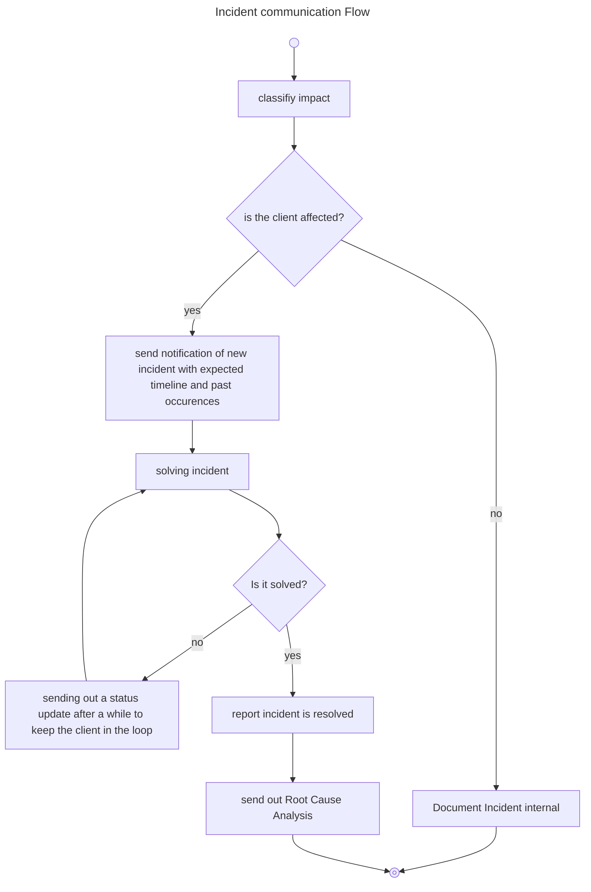

# Client Communication

In this documentation I will write about general communication to client and users. 

## Incident

### Reporting 
Incidents can be reported from different ways. This affects the communication.

For example a client reported incident needs to have clear communication to the client.

Lots of incidents also are reported internally for example by Monitoring systems, etc...

### Flow

### Information

The following information should be communicated:

* What is the impact for the client?
    * is the application down or just degraded?
* Is any data lost?
* Is any data (potentially) accessible by unintended third parties?
* Expected timeline
* Were remediation actions for the future planned?
    * to give safety for the client

### Implemntation

To implement this some kind of Incident management must be implemented. In best case this supports the flow. The flow in the implemntation is going to be more complicated, as internal states also need to be communicated.

Also directly define Ownerships and Templates so it is clear who is responsible and in what format it should be send.

## Unplanned Change

Unplanned Changes should b

## Planned Change

## Reporting

## GDPR

## Architecture

## Tools

