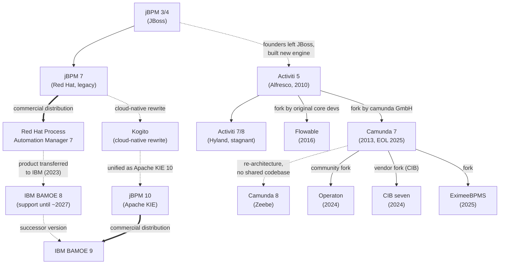

# Workflow Engine - Technology comparison

Comparison of BPMN-based workflow engines, assessed as of **July 2026**.

**Rating scale:** 0 = not supported · 1 = basic/partial support · 2 = good support with gaps · 3 = completely and fluently supported

> **No total score is given deliberately.** The categories are not equally important — weight them according to the concrete use case (e.g. for client-specific product installations, configurability, migration of running processes, testability and OIDC support usually matter far more than raw scalability).

## Engine Lineage

Most of the compared engines are related — several are forks or successors of each other. Solid arrows are forks (shared codebase), dotted arrows are successors (new architecture by the same team/vendor), thick arrows are commercial distributions of an open source engine.

## Tool Overview

### Camunda 7

The classic embeddable Java BPMN/DMN engine that dominated the open source BPM space for a decade. The community edition reached **end of life in October 2025** (final release 7.24; enterprise customers get support until April 2030, with a paid extended-support option until April 2032). Its lineage lives on in several forks — [Operaton](https://operaton.org) (community-driven), [CIB seven](https://cibseven.org/en/) (vendor-backed) and [EximeeBPMS](https://eximeebpms.org/) — and historically in Flowable and Activiti, which share the same ancestry.

* Website: <https://camunda.com/platform-7/>
* Documentation: <https://docs.camunda.org>
* Source: <https://github.com/camunda/camunda-bpm-platform>

### Camunda 8

Cloud-native process orchestration platform built around the Zeebe engine. A complete re-architecture compared to Camunda 7, designed for horizontal scaling and SaaS-first operation. Camunda 8 was never fully open source in the OSI sense (Zeebe had been under the source-available Zeebe Community License, the web apps proprietary); since version 8.6 all core components are unified under the source-available *Camunda License 1.0*, and — the practical change — production use of Self-Managed now requires a commercial license (free for development/non-production use).

* Website: <https://camunda.com>
* Documentation: <https://docs.camunda.io>
* Source: <https://github.com/camunda/camunda>

### jBPM 7

The last "classic" generation of jBPM (JBoss/Red Hat): a mature, embeddable Java engine deeply integrated with the Drools rule engine, plus the Business Central workbench and KIE Server runtime. Still widely deployed, but the community has moved on to the Kogito-based Apache KIE 10 line — jBPM 7 is in maintenance mode; commercial support is available via IBM BAMOE 8 until roughly September 2027.

* Website: <https://www.jbpm.org>
* Documentation: <https://docs.jbpm.org>
* Source: <https://github.com/kiegroup/jbpm>

**End of life & migration references:**

* [IBM BAMOE Software Support Lifecycle Addendum](https://www.ibm.com/support/pages/ibm-business-automation-manager-open-editions-software-support-lifecycle-addendum) — official lifecycle policy; the BAMOE 8 transition date (end of standard support for the jBPM-7-based product line) is September 30, 2027.
* [IBM BAMOE 8.x support overview](https://www.ibm.com/support/pages/ibm-business-automation-manager-open-editions8x) — support entry point for the jBPM-7-based BAMOE 8 releases and fix packs.
* [Red Hat Process Automation Manager product page](https://access.redhat.com/products/red-hat-process-automation-manager/) — the former commercial home of jBPM 7; the product was transferred to IBM in 2023 and is in its final maintenance phase (see the [Red Hat middleware update and support policy](https://access.redhat.com/support/policy/updates/jboss_notes) for the phase definitions).
* [IBM migration guide: Red Hat PAM v7 to BAMOE v8](https://www.ibm.com/docs/en/ibamoe/9.0.x?topic=guide-red-hat-v7-bamoe-v8) — the official path from the Red Hat product onto supported BAMOE 8.
* [IBM BAMOE 9.x migration guide](https://www.ibm.com/docs/en/ibamoe/9.1.x?topic=migration-guide) — the de-facto guide for moving from the jBPM 7 generation to the Kogito-based jBPM 10/KIE 10 stack (there is no dedicated Apache community migration guide); note that this is a re-implementation, not an in-place upgrade.
* [Apache KIE — jBPM](https://kie.apache.org/components/jbpm/) — the community project page; all active development happens on the Kogito-based Apache KIE 10 line, not on jBPM 7.

### jBPM 10

The current generation of jBPM, released as part of the unified [Apache KIE (incubating)](https://kie.apache.org) 10.x line (Drools, jBPM, Kogito, SonataFlow share one release train). It is a clean break from jBPM 7: Business Central and KIE Server are gone, and the runtime is the Kogito engine — BPMN/DMN models are compiled into Quarkus or Spring Boot applications at build time. KIE 10.2 introduced a new BPMN editor replacing the legacy GWT tooling.

> **Note:** jBPM 10 and Kogito are effectively the same technology today — "jBPM" is the process-automation branding of the Kogito-based Apache KIE stack. Their ratings below are therefore almost identical.

* Website: <https://www.jbpm.org> / <https://kie.apache.org/components/jbpm/>
* Documentation: <https://kie.apache.org/docs/10.2.x/kogito/>
* Source: <https://github.com/apache/incubator-kie-kogito-runtimes>

### Kogito

The cloud-native successor of jBPM 7/Drools, also part of Apache KIE (incubating) — and since the KIE 10 unification, the runtime underneath jBPM 10. Follows a "workflow to code" approach: BPMN/DMN models are compiled into Quarkus or Spring Boot applications at build time — the process definition becomes part of the deployable artifact rather than being deployed into a central engine.

* Website: <https://kogito.kie.org>
* Apache KIE: <https://kie.apache.org/components/kogito/>
* Source: <https://github.com/apache/incubator-kie-kogito-runtimes>

### IBM BAMOE

IBM Business Automation Manager Open Editions is not a separate engine but the **commercial distribution of the KIE stack** — it is therefore not rated as its own column in the matrix. It is the successor of Red Hat Process Automation Manager (the product was transferred from Red Hat to IBM in 2023): **BAMOE 8** is the supported build of the jBPM 7 generation (support until ~September 2027), **BAMOE 9** is the supported build of the Kogito/Apache KIE 10 generation. For jBPM 7 or jBPM 10/Kogito, BAMOE is the answer to the "Commercial Support Option" category.

* Website: <https://www.ibm.com/products/business-automation-manager-open-editions>
* Lifecycle: <https://www.ibm.com/support/pages/ibm-business-automation-manager-open-editions-software-support-lifecycle-addendum>
* Source: <https://github.com/IBM/bamoe>

### Operaton

Community-driven fork of Camunda 7, created after Camunda announced the end of life of the Camunda 7 community edition. Goal: keep a truly free (Apache 2.0) embeddable BPMN engine alive. Actively developed (2.x releases), but still a young project.

* Website: <https://operaton.org>
* Documentation: <https://docs.operaton.org>
* Source: <https://github.com/operaton/operaton>

### CIB seven

Vendor-backed fork of Camunda 7 by CIB, a German software company and former Camunda partner. Apache 2.0 licensed, with commercial enterprise support as the business model — positioned as the drop-in continuation of Camunda 7 for organizations that need SLAs. Actively developed (2.x releases with an own web modeler and AI-agent features).

* Website: <https://cibseven.org/en/>
* Documentation: <https://docs.cibseven.org>
* Source: <https://github.com/cibseven/cibseven>

### Flowable

Fork of Activiti 5 (2016), created by Activiti's original core developers — making it a sibling of Camunda 7 in the same engine family. The open source engines (BPMN, CMMN, DMN, event registry) are actively developed under Apache 2.0, while Flowable AG sells an enterprise platform (Flowable Work/Design) on top; the open source UI/modeler applications were deprecated in favor of the commercial tools.

* Website: <https://www.flowable.com/open-source>
* Documentation: <https://www.flowable.com/open-source/docs/>
* Source: <https://github.com/flowable/flowable-engine>

### Activiti

One of the original open source BPMN 2.0 engines (and the common ancestor of Camunda 7 and Flowable). Driven by Alfresco (now Hyland); the community edition has stagnated since most contributors left for the Flowable fork. Version 7/8 focuses on a "cloud" runtime that never fully matured.

* Website: <https://www.activiti.org>
* Source: <https://github.com/Activiti/Activiti>

## Summary Matrix

| Category | Camunda 7 | Camunda 8 | jBPM 7 | jBPM 10 | Kogito | Operaton | CIB seven | Flowable | Activiti |
|---|:---:|:---:|:---:|:---:|:---:|:---:|:---:|:---:|:---:|
| Deployment (Windows, Linux, Kubernetes) | 2 | 2 | 2 | 3 | 3 | 2 | 2 | 2 | 2 |
| Developer Experience | 3 | 3 | 1 | 2 | 2 | 2 | 2 | 2 | 1 |
| Documentation | 3 | 3 | 2 | 1 | 1 | 1 | 2 | 2 | 1 |
| FOSS Support | 1 | 1 | 3 | 3 | 3 | 3 | 2 | 2 | 2 |
| Configurability / client-specific environments | 3 | 2 | 3 | 2 | 2 | 3 | 3 | 3 | 2 |
| BPMN Support | 3 | 2 | 3 | 2 | 2 | 3 | 3 | 3 | 2 |
| Rule Engine Support | 1 | 1 | 3 | 3 | 3 | 1 | 1 | 1 | 1 |
| DMN Support | 2 | 3 | 3 | 3 | 3 | 2 | 2 | 2 | 0 |
| Commercial Support Option | 2 | 3 | 2 | 2 | 2 | 1 | 3 | 3 | 2 |
| Safety for Future Updates | 0 | 2 | 1 | 2 | 2 | 1 | 2 | 2 | 1 |
| Human Task Management | 3 | 3 | 3 | 2 | 2 | 3 | 3 | 2 | 1 |
| Migration & Versioning of Running Processes | 3 | 2 | 2 | 1 | 1 | 3 | 3 | 2 | 1 |
| Observability & Operations | 3 | 3 | 2 | 2 | 2 | 2 | 2 | 2 | 1 |
| Performance & Scalability | 2 | 3 | 2 | 2 | 2 | 2 | 2 | 2 | 2 |
| Integration Ecosystem | 2 | 3 | 2 | 2 | 2 | 2 | 2 | 2 | 1 |
| Testability | 3 | 2 | 2 | 3 | 3 | 3 | 3 | 3 | 2 |
| Security & Multi-Tenancy | 2 | 3 | 2 | 1 | 1 | 2 | 2 | 2 | 1 |
| OIDC Support (user tasks & integration) | 1 | 3 | 2 | 2 | 2 | 1 | 1 | 1 | 2 |
| Learning Curve / Hiring Pool | 3 | 3 | 2 | 1 | 1 | 2 | 2 | 2 | 1 |
| Community Activity | 1 | 2 | 1 | 2 | 2 | 2 | 2 | 2 | 1 |

## Ratings by Category

### Deployment (Windows, Linux, Kubernetes)

| Tool | Rating | Rationale |
|---|:---:|---|
| Camunda 7 | 2 | Extremely flexible: embeddable library, Spring Boot starter, or standalone server — runs anywhere Java runs, with a single relational database as the only dependency. Runs fine in Kubernetes as a stateless app, but scaling is limited by the shared-database architecture (no cloud-native partitioning). |
| Camunda 8 | 2 | Kubernetes-first: official Helm charts, designed for horizontal scaling. Since 8.8, Zeebe, Operate, Tasklist and Identity ship as a single "Orchestration Cluster" artifact, which simplifies deployment considerably — but Elasticsearch/OpenSearch remains a required dependency, keeping small Linux/Windows installations heavy. `Camunda 8 Run` eases local development, but a lightweight single-server production deployment is not the target architecture. |
| jBPM 7 | 2 | Pure Java — runs on Windows and Linux (embedded, Spring Boot, or WildFly/KIE Server). Kubernetes deployment works as containerized Java apps, but the architecture (Business Central, KIE Server) predates cloud-native design; no first-class operator/scaling story. |
| jBPM 10 | 3 | Processes compile into plain Quarkus/Spring Boot services (optionally GraalVM native images) — container- and Kubernetes-native by design, with operators and add-ons for the cloud. Being ordinary Java applications, they run equally well on Windows and Linux. No heavyweight server components (Business Central/KIE Server were dropped). |
| Kogito | 3 | Identical to jBPM 10 — same Kogito runtime: cloud-native Quarkus/Spring Boot services, unproblematic on Windows and Linux. |
| Operaton | 2 | Inherits Camunda 7's flexible deployment model unchanged (embeddable, Spring Boot, standalone; single database dependency); same shared-database scaling limits in Kubernetes. |
| CIB seven | 2 | Same Camunda 7 deployment model: embeddable, Spring Boot or standalone with a single database; Docker images provided. Same shared-database scaling limits in Kubernetes. |
| Flowable | 2 | Same architecture family as Camunda 7: embeddable engine or Spring Boot application with a relational database — runs on Windows, Linux and in containers/Kubernetes without issues, but without cloud-native partitioning or an official operator for the open source engine. |
| Activiti | 2 | Classic embeddable Java engine — unproblematic on Windows and Linux. The Activiti Cloud initiative targeted Kubernetes but never fully matured; container deployment works, yet lacks polished charts/operators and current deployment guidance. |

### Developer Experience

| Tool | Rating | Rationale |
|---|:---:|---|
| Camunda 7 | 3 | The benchmark for embedded engine DX for years: Camunda Modeler, Spring Boot starter, Java delegate model, Cockpit/Tasklist, first-class testing support and a huge body of community knowledge. Everything still works — it just won't improve further. |
| Camunda 8 | 3 | Best-in-class tooling: Desktop and Web Modeler, Play mode for instant process testing, official clients for Java/Spring, Node.js, Go and more, plus Operate for runtime insight. Onboarding via SaaS takes minutes, not days. |
| jBPM 7 | 1 | Development is centered on Business Central, a heavyweight, dated web workbench. The IDE story is weak, feedback cycles are slow, and the KJAR/Maven deployment model feels cumbersome by today's standards. |
| jBPM 10 | 2 | Modern code-first workflow: Quarkus dev mode with hot reload, VS Code BPMN/DMN extensions, and since KIE 10.2 a new BPMN editor replacing the legacy GWT tooling. Processes are plain code artifacts with normal unit testing. Deductions: tooling is still maturing after the editor rewrite, and migrating from jBPM 7 is effectively a re-implementation. |
| Kogito | 2 | Same experience as jBPM 10 (same runtime and tooling): pleasant code-first development with rough edges and breaking changes between releases. |
| Operaton | 2 | Inherits Camunda 7's excellent embedded developer experience: Spring Boot starter, Java delegate model, Cockpit and a mature testing library. Deduction because the project's own tooling ecosystem (modeler, IDE integration) still leans on Camunda-compatible third-party tools. |
| CIB seven | 2 | Same inherited Camunda 7 developer experience, and CIB invests in its own tooling (web modeler). Deduction: the new tooling is young, and the developer community around the fork is still small. |
| Flowable | 2 | Clean, well-designed Java APIs and solid Spring Boot integration; development feels similar to Camunda 7/Operaton. Deduction: the open source modeler and UI apps were deprecated — comfortable modeling and runtime inspection tooling is reserved for the commercial Flowable Design/Work products. |
| Activiti | 1 | The core Java API is straightforward, but tooling is outdated (the Eclipse designer is abandoned), the v6→v7 "cloud" API split is confusing, and examples/guides are stale. |

### Documentation

| Tool | Rating | Rationale |
|---|:---:|---|
| Camunda 7 | 3 | Complete, well-written reference documentation plus a decade of blog posts, forum answers and books — the best-documented engine in this family. Caveat: the docs are frozen along with the product. |
| Camunda 8 | 3 | Comprehensive, well-structured and actively maintained docs at docs.camunda.io, complemented by best-practice guides, an active forum and an academy. |
| jBPM 7 | 2 | Very extensive reference documentation exists, but it is a single monolithic document, partly outdated, and split across jbpm.org and Red Hat/IBM product docs — finding current answers takes effort. |
| jBPM 10 | 1 | jBPM 10 documentation *is* the Kogito documentation on kie.apache.org — noticeably thinner than the (dated but exhaustive) jBPM 7 reference manual. The ASF migration left docs in a transitional state, and most community content (blogs, Stack Overflow) still targets jBPM 7 concepts that no longer apply. |
| Kogito | 1 | Fragmented across kogito.kie.org, kie.apache.org and old Red Hat guides; many examples target outdated versions. The ASF migration left documentation in a transitional state. |
| Operaton | 1 | Documentation is being adapted from the Camunda 7 docs and is still incomplete/in migration. The upside: most Camunda 7 knowledge (docs, blog posts, Stack Overflow) applies almost 1:1 — but that is inherited, not project-owned. |
| CIB seven | 2 | Vendor-maintained adaptation of the Camunda 7 documentation at docs.cibseven.org — further along than Operaton's thanks to dedicated staffing, and the same huge body of Camunda 7 community knowledge applies. Still an adaptation in progress, not yet independently grown. |
| Flowable | 2 | Solid, current documentation for the open source engines (BPMN, CMMN, DMN) and an active forum — but noticeably less depth than Camunda's docs, and advanced topics increasingly point toward the commercial platform documentation. |
| Activiti | 1 | The user guide covers the old v6-style API reasonably, but Activiti 7 documentation is thin, partly broken, and community answers are mostly years old. |

### FOSS Support

| Tool | Rating | Rationale |
|---|:---:|---|
| Camunda 7 | 1 | The existing code is Apache 2.0 and free to use forever, but the community edition is end of life — no maintained FOSS line exists from the vendor anymore. Continued FOSS life happens in the forks (Operaton, CIB seven, EximeeBPMS), not in Camunda 7 itself. |
| Camunda 8 | 1 | Since 8.6, core components are under the source-available Camunda License 1.0: free for development and non-production, but **production use requires a commercial license**. Not open source in the OSI sense. |
| jBPM 7 | 3 | Apache License 2.0, fully open including Business Central and KIE Server — no open-core split. |
| jBPM 10 | 3 | Apache License 2.0 under the Apache Software Foundation (KIE, incubating) — vendor-neutral governance, no open-core split for the engine. |
| Kogito | 3 | Apache License 2.0 under the Apache Software Foundation (incubating). Vendor-neutral governance is a stated goal of the ASF migration. |
| Operaton | 3 | Apache License 2.0 and community-driven governance is the project's founding purpose — it exists precisely to keep a truly free Camunda-7-class engine available. |
| CIB seven | 2 | Apache License 2.0 including the web apps — genuinely open source. Deduction for single-vendor governance: the roadmap is set by CIB, and the fork's openness has no independent community safeguard comparable to Operaton's. |
| Flowable | 2 | The engines are Apache 2.0 and actively maintained — but the project is open-core under single-vendor control: modeling and UI tooling moved to the commercial side, and the roadmap follows Flowable AG's product interests. |
| Activiti | 2 | Apache License 2.0, so licensing is clean — but "support" through the community is minimal: low activity, few maintainers, and advanced features are reserved for the commercial Alfresco/Hyland product. |

### Configurability / Supporting Client-Specific Environments

| Tool | Rating | Rationale |
|---|:---:|---|
| Camunda 7 | 3 | The reference for adaptability: embedded or standalone, process engine plugins, custom identity services, shared or per-tenant engines, any JDBC database. Ideal for shipping inside client-specific product installations — which is exactly why its EOL hurt so many products. |
| Camunda 8 | 2 | Good multi-tenancy and IdP integration; self-managed gives infrastructure freedom. But the engine is remote-only (no embedded mode), the component set is fixed, and deep customization (custom persistence, engine plugins as in Camunda 7) is not possible. Heavy footprint for small client-specific installations. |
| jBPM 7 | 3 | Extremely adaptable: embeddable engine, pluggable persistence, human task service, listeners and work item handlers everywhere. Can be shaped from a tiny embedded library to a full BPM platform per client. |
| jBPM 10 | 2 | Configuration via standard Quarkus/Spring mechanisms is easy, and each deployment is a normal application build. However, the build-time compilation model makes *runtime* deployment of client-specific process variants harder than with a classic engine, and much of jBPM 7's deep pluggability (persistence, human task service internals) did not carry over. |
| Kogito | 2 | Identical to jBPM 10: flexible as a normal application build, limited for runtime-deployed client-specific process variants. |
| Operaton | 3 | Full Camunda 7 flexibility: embedded or standalone, process engine plugins, custom identity services, shared or per-tenant engines, any JDBC database. Very well suited for shipping inside client-specific product installations. |
| CIB seven | 3 | Same full Camunda 7 flexibility as Operaton: engine plugins, pluggable identity, per-tenant engines, any JDBC database — designed to be a drop-in replacement for existing Camunda 7 installations. |
| Flowable | 3 | Same family strengths: fully embeddable, runtime process deployment, pluggable identity/persistence hooks, multi-tenancy support, any major JDBC database — well suited for embedding into client-specific products. |
| Activiti | 2 | The classic embeddable engine is flexible (similar roots as Camunda 7/Operaton), but fewer extension points survived into v7, and the neglected state of the project makes betting on deep customization risky. |

### BPMN Support

| Tool | Rating | Rationale |
|---|:---:|---|
| Camunda 7 | 3 | Essentially complete BPMN 2.0 execution coverage, hardened by a decade of production use — one of the most complete implementations available. |
| Camunda 8 | 2 | Coverage has grown strongly (inclusive gateways, compensation, escalation, ad-hoc subprocesses, execution listeners), but it is still not the full Camunda 7 coverage, and FEEL-only expressions plus the remote job-worker model change some modeling patterns. Broad, fluent — but with gaps. |
| jBPM 7 | 3 | Long-standing, near-complete BPMN 2.0 coverage including compensation, signals, multi-instance and complex event handling — proven over many years in production. |
| jBPM 10 | 2 | The Kogito-based runtime supports the common BPMN constructs well, but has not (yet) reached the near-complete coverage jBPM 7 had built up over the years; some advanced elements and patterns are unsupported or behave differently in the compiled model. |
| Kogito | 2 | Same engine, same assessment as jBPM 10: solid coverage of the common constructs, gaps in the advanced ones. |
| Operaton | 3 | Inherits Camunda 7's essentially complete BPMN 2.0 execution coverage unchanged. |
| CIB seven | 3 | Inherits Camunda 7's essentially complete BPMN 2.0 execution coverage unchanged. |
| Flowable | 3 | Near-complete BPMN 2.0 coverage, actively maintained and extended — plus CMMN 1.1 as a fully supported sibling engine for case management, which none of the others offer. |
| Activiti | 2 | The core engine has broad BPMN 2.0 coverage (shared heritage with Camunda 7), but the promoted Activiti 7 "cloud" programming model exposes only a subset, and stalled development means the coverage no longer evolves. |

### Rule Engine Support

| Tool | Rating | Rationale |
|---|:---:|---|
| Camunda 7 | 1 | Business rule tasks delegate to the built-in DMN evaluation or custom Java — no general-purpose rule engine. Drools can be integrated manually. |
| Camunda 8 | 1 | No general-purpose rule engine — business rule tasks are DMN decision evaluations only. Complex rule scenarios (rete-style inference, rule chaining) require external systems. |
| jBPM 7 | 3 | Native, deep Drools integration — the reference open source rule engine. Rules and processes share the same runtime (KIE sessions), enabling true rule-driven processes. |
| jBPM 10 | 3 | Drools 10 is part of the same unified KIE release: rule units, DRL and decisions compile into the same service as the processes — the reference open source rule engine, fully integrated. |
| Kogito | 3 | Drools is a first-class citizen: rule units, DRL and decisions compile into the same service as the processes. Modernized rule programming model. |
| Operaton | 1 | Like Camunda 7: business rule tasks delegate to the built-in DMN evaluation or custom Java — no full rule engine. Drools can be integrated manually, but nothing is provided out of the box. |
| CIB seven | 1 | Same as the rest of the Camunda 7 lineage: DMN evaluation or custom Java only, no general-purpose rule engine. |
| Flowable | 1 | Business rule evaluation is covered by the DMN engine and simple expression-based rules; no general-purpose inference engine comparable to Drools. |
| Activiti | 1 | Only a basic, legacy Drools hook for business rule tasks; barely maintained and rarely used in practice. |

### DMN Support

| Tool | Rating | Rationale |
|---|:---:|---|
| Camunda 7 | 2 | Built-in DMN engine with full FEEL 1.2 support (the FEEL Scala engine is the default since 7.13): decision tables, literal expressions and DRDs work fluently, but only a subset of the DMN standard is implemented (no boxed expressions / conformance level 3). |
| Camunda 8 | 3 | Full DMN decision tables and DRDs with a first-class FEEL engine, integrated modeling and evaluation tracing in Operate. |
| jBPM 7 | 3 | Includes the Drools DMN engine — among the highest DMN conformance levels available (full FEEL, boxed expressions, DRDs). |
| jBPM 10 | 3 | Ships the Drools DMN engine — among the highest DMN conformance levels available (full FEEL, boxed expressions, DRDs); decisions can also be deployed as standalone decision services. |
| Kogito | 3 | Uses the same Drools DMN engine with full conformance; decisions can even be deployed as standalone decision services. |
| Operaton | 2 | Inherits Camunda 7's DMN engine incl. the full-FEEL Scala engine: decision tables, literal expressions and DRDs work fluently, but it implements only a subset of the DMN standard (no boxed expressions / conformance level 3). |
| CIB seven | 2 | Same inherited Camunda 7 DMN engine: fluent decision tables, subset of the standard. |
| Flowable | 2 | Own open source DMN engine supporting decision tables and decision services — practical and integrated, but it covers only part of the DMN standard (expressions are JUEL-based, no FEEL conformance). |
| Activiti | 0 | The open source Activiti engine has no DMN support — DMN is only available in the commercial Alfresco Process Services product (the Flowable fork added its own DMN engine, the Activiti community did not). |

### Commercial Support Option

| Tool | Rating | Rationale |
|---|:---:|---|
| Camunda 7 | 2 | Camunda still sells enterprise support (until April 2030, paid extension to April 2032 available), and forks like CIB seven offer commercial continuity — but all offerings are maintenance-oriented; nobody sells a feature future for Camunda 7. |
| Camunda 8 | 3 | Strong single-vendor commercial offering: SaaS and self-managed enterprise subscriptions, professional services, partner network and predictable SLAs — commercial support is the business model. |
| jBPM 7 | 2 | Commercial support exists via IBM BAMOE (successor of Red Hat Process Automation Manager), but jBPM 7 is the legacy line — support pushes you toward the newer BAMOE/KIE stack. |
| jBPM 10 | 2 | [IBM BAMOE](https://kie.apache.org/docs/community/commercial-support/) (successor of Red Hat Process Automation Manager/Decision Manager) provides developer and production support for this stack — solid, but only for the IBM-curated subset of components and versions, and a smaller vendor commitment than Camunda's single-product focus. |
| Kogito | 2 | Same channel as jBPM 10: IBM BAMOE supports a subset of Apache KIE/Kogito components, not the full community feature set. |
| Operaton | 1 | No large vendor behind it; support is available from individual consultancies and community maintainers. |
| CIB seven | 3 | Commercial support is the raison d'être of the fork: CIB offers enterprise subscriptions, SLAs and migration services for existing Camunda 7 installations. Deduction-free within its scope, though CIB is a much smaller vendor than Camunda or IBM. |
| Flowable | 3 | Flowable AG is a dedicated vendor built around the engine: enterprise platform (Flowable Work/Design), SLAs, professional services and support for the open source core — commercial support is the business model. |
| Activiti | 2 | Hyland (Alfresco) sells Alfresco Process Services, the supported product line based on Activiti — available, but oriented toward the Alfresco ecosystem rather than plain-engine users. |

### Safety for Future Updates

| Tool | Rating | Rationale |
|---|:---:|---|
| Camunda 7 | 0 | End of life: the community edition receives no updates at all, enterprise support runs only until April 2030 (paid extension to 2032), and the vendor's answer is a migration to the architecturally different Camunda 8. A future exists only via the forks. |
| Camunda 8 | 2 | Well-funded vendor, aggressive roadmap and predictable release train — the product will certainly evolve. Deduction: the unilateral license change in 8.6 and the Camunda 7 EOL demonstrate that strategy shifts are borne by users; no community fallback exists for Camunda 8. |
| jBPM 7 | 1 | Effectively end-of-line: community focus moved to the Kogito-based Apache KIE 10 stack, and the Red Hat product line was transitioned to IBM BAMOE. Expect maintenance only, no feature future. |
| jBPM 10 | 2 | This is the actively developed main line of Apache KIE (regular 10.x releases, IBM BAMOE product backing, ASF governance). Deduction: the project is still ASF *incubating*, has been through turbulent Red Hat→IBM/Apache transitions, and the hard 7→10 break shows that major migrations can be forced on users. |
| Kogito | 2 | Same trajectory as jBPM 10 — the unified KIE 10 line is actively released. Residual uncertainty: incubating status, past refocusing (e.g. serverless workflows spun into SonataFlow), and the Kogito brand itself is gradually being absorbed into jBPM/KIE naming. |
| Operaton | 1 | Active releases and a motivated community, but the project is young, volunteer-driven and one of several competing Camunda 7 forks (Operaton, CIB seven, EximeeBPMS) — the ecosystem may consolidate; long-term sustainability is not yet proven. |
| CIB seven | 2 | A committed vendor with paying customers gives the fork a more predictable trajectory than a volunteer project, and releases are regular. Deduction: the future rests on one mid-sized company's strategy, and the Camunda 7 fork ecosystem may still consolidate. |
| Flowable | 2 | Continuously developed for almost a decade with a stable vendor behind it and no disruptive re-architecture on the horizon. Deduction: single-vendor open-core governance — the Activiti→Flowable history itself shows how vendor decisions can split such projects, and open source tooling has already been trimmed in favor of commercial products. |
| Activiti | 1 | The community edition shows minimal activity: releases mostly track dependency updates, the core team departed to Flowable years ago, and Hyland's strategic interest lies in its commercial products. |

### Human Task Management

| Tool | Rating | Rationale |
|---|:---:|---|
| Camunda 7 | 3 | Complete task lifecycle (claim, delegate, escalate, candidate users/groups), an out-of-the-box Tasklist web app, embedded and generated forms, and task filters — human workflow was a core strength from day one. |
| Camunda 8 | 3 | First-class Tasklist application, user task lifecycle events, Camunda Forms with a visual form builder, and task APIs for building custom task UIs. |
| jBPM 7 | 3 | Deep human task heritage (WS-HumanTask semantics): full lifecycle including delegation and escalation, group assignment, deadlines, plus task UI and a form modeler in Business Central. |
| jBPM 10 | 2 | The engine inherits jBPM's solid human task semantics (lifecycle, groups, deadlines), and a Task Console container exists — but the console is basic, and form support is thin compared to what Business Central offered in jBPM 7; real projects build their own task UI. |
| Kogito | 2 | Same as jBPM 10: solid task semantics in the engine, basic Task Console, custom UI usually required. |
| Operaton | 3 | Inherits the complete Camunda 7 human task stack including the forked Tasklist web app, embedded forms and task filters. |
| CIB seven | 3 | Inherits the complete Camunda 7 human task stack (Tasklist, forms, filters), maintained and extended by CIB. |
| Flowable | 2 | The engine's task support is complete (identity links, delegation, due dates, form properties), but the open source task UI apps were deprecated — a comfortable task experience requires the commercial Flowable Work or a custom frontend. |
| Activiti | 1 | Core task API exists, but there is no maintained task UI, form handling is rudimentary, and the v7 "cloud" task services never matured. |

### Migration & Versioning of Running Processes

| Tool | Rating | Rationale |
|---|:---:|---|
| Camunda 7 | 3 | The gold standard: versioned deployments plus a dedicated process instance migration API with mapping instructions, batch migration, and (in enterprise Cockpit) UI support — proven with long-running instances over years. |
| Camunda 8 | 2 | Process instance migration and batch operations arrived in the 8.x line (API and Operate UI) and versioning is solid, but the feature is younger and less flexible than Camunda 7's mapping-based migration. |
| jBPM 7 | 2 | Definition versioning plus a process instance migration service with node mapping (admin API) — capable, but less polished and less battle-tested than Camunda 7's migration machinery. |
| jBPM 10 | 1 | The build-time compilation model works against migration: new process versions mean new application builds, and migrating running instances between versions is only rudimentarily supported — a real weakness for long-running processes. |
| Kogito | 1 | Same limitation as jBPM 10: fine for short-lived, event-driven processes; problematic for instances that live through multiple releases. |
| Operaton | 3 | Inherits Camunda 7's full migration machinery: instance migration API, batch operations, version management. |
| CIB seven | 3 | Inherits Camunda 7's full migration machinery: instance migration API, batch operations, version management. |
| Flowable | 2 | Provides a real ProcessInstanceMigrationService with mapping support and definition versioning — solid, though less battle-tested than Camunda 7's and without open source UI support. |
| Activiti | 1 | Definition versioning works, but instance migration is essentially the old "set process definition version" workaround without state mapping — risky for anything non-trivial. |

### Observability & Operations

| Tool | Rating | Rationale |
|---|:---:|---|
| Camunda 7 | 3 | Cockpit for runtime inspection and incident handling, complete history/audit tables queryable via API, and engine metrics — operations teams get everything they need (the most advanced Cockpit features were enterprise-only). |
| Camunda 8 | 3 | Operate for instance inspection and incident resolution, Tasklist, Optimize for analytics, exporter-based history, and Prometheus/Grafana integration — designed for modern observability stacks. |
| jBPM 7 | 2 | Business Central provides process/task monitoring views and full audit logs exist in the database — functional, but the tooling is dated and heavyweight compared to Cockpit or Operate. |
| jBPM 10 | 2 | Cloud-native observability is decent (Prometheus metrics, OpenTelemetry, Data Index service for querying state, Management Console container) — but the consoles are young and shallow compared to Cockpit/Operate. |
| Kogito | 2 | Same as jBPM 10: good metrics/tracing integration, queryable Data Index, immature consoles. |
| Operaton | 2 | Inherits the community-edition Cockpit and full history tables — solid runtime insight, but without the enterprise-only Cockpit features (e.g. advanced instance modification UI) and with a still-small ops tooling ecosystem of its own. |
| CIB seven | 2 | Same inherited community-edition Cockpit and history tables as Operaton; CIB extends the web apps, but the enterprise-grade Cockpit extras of old Camunda EE are not (yet) matched. |
| Flowable | 2 | Complete history/audit tables, Spring Boot Actuator metrics and an event registry provide good raw observability — but there is no open source operations console; visual runtime inspection is commercial. |
| Activiti | 1 | History tables exist and are queryable, but there is no operations UI, no metrics story, and no incident-handling support. |

### Performance & Scalability

| Tool | Rating | Rationale |
|---|:---:|---|
| Camunda 7 | 2 | Excellent single-node throughput and well-understood tuning; scales horizontally with multiple engine nodes on a shared database — until the database becomes the bottleneck. Fine for the vast majority of workloads, not for extreme throughput. |
| Camunda 8 | 3 | Zeebe's partitioned, log-based architecture was built precisely to remove the shared-database bottleneck: horizontal scaling by adding partitions/brokers, proven high-throughput benchmarks. |
| jBPM 7 | 2 | Classic shared-database architecture with solid throughput for typical business processes; KIE Server instances scale horizontally until the database ceiling. |
| jBPM 10 | 2 | Stateless compiled services scale horizontally like any Quarkus/Spring Boot app, with low footprint and fast startup (native images). Deduction: the persistence and Data Index layers still serialize state through a database, and large-scale production evidence is thinner than for Zeebe. |
| Kogito | 2 | Same as jBPM 10: scales like ordinary cloud services; persistence layer is the practical limit. |
| Operaton | 2 | Same profile as Camunda 7: strong throughput up to the shared-database ceiling. |
| CIB seven | 2 | Same profile as Camunda 7: strong throughput up to the shared-database ceiling. |
| Flowable | 2 | Reputation for a lean, fast engine (async executor redesign); same shared-database horizontal scaling model and ceiling as the rest of the family. |
| Activiti | 2 | The core engine architecture is the same family and performs adequately; no recent performance work, but no fundamental deficit either. |

### Integration Ecosystem

| Tool | Rating | Rationale |
|---|:---:|---|
| Camunda 7 | 2 | The external task pattern enables polyglot workers, the REST API is complete, and years of community extensions exist (Camel, Kafka, Keycloak…) — but there is no official connector catalog, and community extensions age along with the platform. |
| Camunda 8 | 3 | Large out-of-the-box connector catalog (REST, Kafka, RabbitMQ, email, many SaaS services), inbound webhooks/polling, and official job-worker clients in multiple languages — the broadest integration story of the group. |
| jBPM 7 | 2 | Work item handlers as a pluggable integration mechanism with a repository of prebuilt handlers (REST, email, Camel, Kafka…) plus the KIE Server REST API — capable, but the handler ecosystem is aging with the platform. |
| jBPM 10 | 2 | Leverages the Quarkus/Spring ecosystems directly (Kafka, Camel, REST clients, OpenAPI generation) and event-driven add-ons — powerful, but integration is code-first: there is no connector catalog; every integration is programming. |
| Kogito | 2 | Same as jBPM 10: excellent framework-level integration, no ready-made connector catalog. |
| Operaton | 2 | Inherits the external task pattern and complete REST API; relies on the aging Camunda 7 community extension ecosystem, which the young project has not yet replaced with its own. |
| CIB seven | 2 | Same inherited external task pattern and REST API; CIB adds its own extensions (e.g. AI-agent integration), but the broader ecosystem is the aging Camunda 7 one. |
| Flowable | 2 | Built-in HTTP task and an event registry with Kafka, JMS and RabbitMQ adapters cover the common cases; beyond that, integration is custom Java/Spring code. |
| Activiti | 1 | Basic REST and Java APIs only; the old Camel/Mule modules are dead, and the v7 cloud connectors never became production-grade. |

### Testability

| Tool | Rating | Rationale |
|---|:---:|---|
| Camunda 7 | 3 | Exemplary: in-memory engine with JUnit extensions, the camunda-bpm-assert fluent assertion library, process test coverage visualization — process unit tests run in milliseconds in any CI. |
| Camunda 8 | 2 | Camunda Process Test / zeebe-process-test enable real automated tests, but they spin up an engine (testcontainers/embedded) — heavier and slower than Camunda 7-style unit tests, and FEEL expressions are only evaluated in the real engine. |
| jBPM 7 | 2 | In-memory engine testing via JbpmJUnitBaseTestCase works reliably, but the test API is clunkier than Camunda's and lacks a comparable assertion/coverage ecosystem. |
| jBPM 10 | 3 | Processes compile to plain code, so standard JUnit plus Quarkus/Spring test support applies directly — process logic, rules and decisions are testable like any other code, which is a core benefit of the workflow-to-code approach. |
| Kogito | 3 | Same as jBPM 10: natural unit and integration testing with standard framework tooling. |
| Operaton | 3 | Inherits Camunda 7's testing stack (in-memory engine, JUnit support, assertion library) — fast, CI-friendly process tests. |
| CIB seven | 3 | Inherits Camunda 7's testing stack (in-memory engine, JUnit support, assertion library) — fast, CI-friendly process tests. |
| Flowable | 3 | First-class test support: in-memory engine, JUnit 5 `@FlowableTest` extension, deployment annotations — same quality as the Camunda 7 lineage. |
| Activiti | 2 | Classic in-memory engine testing still works reliably, but the tooling around it (assertions, coverage) is stale or missing. |

### Security & Multi-Tenancy

| Tool | Rating | Rationale |
|---|:---:|---|
| Camunda 7 | 2 | Built-in tenant model (tenant-aware deployments and queries) and a fine-grained authorization service, plus pluggable identity (LDAP provided). Deduction: SSO/modern auth integration is do-it-yourself, and webapp authorizations are coarse in places. |
| Camunda 8 | 3 | Dedicated Identity component with IdP integration, multi-tenancy support across the stack (since 8.3+), per-tenant data isolation within one cluster, and resource-based authorizations — the most current security architecture of the group. |
| jBPM 7 | 2 | Role-based security in Business Central/KIE Server (Elytron/LDAP integration) and per-KIE-container isolation give workable security and tenancy — solid for its era, dated by today's standards. |
| jBPM 10 | 1 | Security is delegated entirely to the surrounding application framework (Quarkus/Spring Security); the engine itself offers little built-in authorization, and multi-tenancy means separate deployments per tenant — workable, but nothing is provided. |
| Kogito | 1 | Same as jBPM 10: framework-level security only, no engine-level authorization or tenancy model. |
| Operaton | 2 | Inherits Camunda 7's tenant model, authorization service and pluggable identity providers unchanged. |
| CIB seven | 2 | Inherits Camunda 7's tenant model, authorization service and pluggable identity providers unchanged. |
| Flowable | 2 | Tenant-aware engines and a pluggable IDM module cover the basics; authorization granularity is thinner than Camunda 7's, and modern IdP integration is left to Spring Security wiring. |
| Activiti | 1 | Rudimentary identity management and tenancy hooks exist in the engine, but the security story around them is dated and unmaintained. |

### OIDC Support (User Tasks & General Integration)

| Tool | Rating | Rationale |
|---|:---:|---|
| Camunda 7 | 1 | No out-of-the-box OIDC: securing the webapps (Tasklist/Cockpit) and REST API with an IdP requires community plugins (e.g. the well-known Keycloak identity provider extension) or custom Spring Security wiring — proven, but do-it-yourself. |
| Camunda 8 | 3 | OIDC is the native auth model: the Identity component integrates Keycloak or any generic OIDC provider for all web apps (Tasklist login, user/group mapping for task assignment) and issues M2M tokens for API clients and job workers. |
| jBPM 7 | 2 | Keycloak/RH-SSO integration for Business Central and KIE Server was officially documented and supported (including group resolution for task assignment) — workable OIDC, though configuration-heavy and tied to the dated server stack. |
| jBPM 10 | 2 | The generated Quarkus/Spring Boot services secure their APIs via the frameworks' first-class OIDC support, and the consoles integrate with Keycloak — straightforward for API integration, but mapping IdP identities onto task assignment (users/groups) is left to the application. |
| Kogito | 2 | Same as jBPM 10: fluent OIDC at the framework level, task-level identity mapping is your code. |
| Operaton | 1 | Same situation as Camunda 7: OIDC for the web apps and REST API via the (forked) Keycloak plugin approach or manual Spring Security configuration — no first-class OIDC integration of its own yet. |
| CIB seven | 1 | Same inherited situation: OIDC via the Keycloak identity provider plugin or Spring Security wiring rather than a first-class integration — though as a supported product, CIB assists with the setup. |
| Flowable | 1 | The open source IDM module has no OIDC provider out of the box; securing APIs and mapping IdP groups to task candidate groups requires custom Spring Security integration (SSO is a feature of the commercial Flowable Work). |
| Activiti | 2 | Ironically a relative strength: the Activiti 7 cloud stack was built around Keycloak for both API security and user/group resolution for task assignment — but it is tied to the immature and now-stagnant cloud runtime. |

### Learning Curve / Hiring Pool

| Tool | Rating | Rationale |
|---|:---:|---|
| Camunda 7 | 3 | The largest talent pool in the BPM space: years of widespread adoption, abundant training material, and concepts most process-automation developers already know. |
| Camunda 8 | 3 | Camunda skills remain the most marketable; the academy, certification program and huge community keep the pipeline full. The C7→C8 model change requires some relearning, but the market has largely made that shift. |
| jBPM 7 | 2 | A sizable pool of practitioners exists from the Red Hat era, but it is aging, and the Business Central-centric skill set does not transfer to modern stacks. |
| jBPM 10 | 1 | Practitioners are rare: jBPM 7 veterans face a re-learning curve (new architecture), and the Quarkus-centric, code-first model with thin documentation makes onboarding slow. |
| Kogito | 1 | Same as jBPM 10: a niche skill set; hiring for it means hiring good Java/Quarkus developers and training them. |
| Operaton | 2 | Every Camunda 7 developer is immediately productive — a large transferable pool today. Deduction: the pool will shrink as Camunda 7 fades from the market, and "Operaton" itself has no name recognition among candidates yet. |
| CIB seven | 2 | Same advantage as Operaton: Camunda 7 skills transfer 1:1, and CIB offers training. The fork's own name recognition is still minimal. |
| Flowable | 2 | A solid, if smaller, pool (particularly in Europe); concepts transfer readily from Camunda 7/Activiti experience, and the learning curve of the engine itself is gentle. |
| Activiti | 1 | Few current practitioners; most experience in the market is years old and predates the confusing v7 split. |

### Community Activity

| Tool | Rating | Rationale |
|---|:---:|---|
| Camunda 7 | 1 | The forum remains a rich archive and still sees traffic, but the product is frozen: no new community releases, and energy is visibly draining toward Camunda 8 and the forks. |
| Camunda 8 | 2 | Very active forum, meetups and content stream — but it is a vendor-driven community: outside contributions to the codebase are minimal, especially since the license change. |
| jBPM 7 | 1 | Legacy line: no meaningful new development, community attention has moved to the Apache KIE 10 stack. |
| jBPM 10 | 2 | Regular Apache KIE releases (10.0/10.1/10.2), ASF-governed contribution process and multiple corporate contributors — moderate but genuine open source activity. |
| Kogito | 2 | Same KIE community as jBPM 10: active mailing lists/GitHub, moderate contributor base. |
| Operaton | 2 | Small but energetic: frequent releases, responsive maintainers, open governance discussions — exactly what you'd expect from a young mission-driven fork, minus the volume of an established community. |
| CIB seven | 2 | Steady vendor-driven releases and growing adoption among ex-Camunda-7 users; external contributions are still rare — the community is customers more than contributors. |
| Flowable | 2 | Steady release cadence and an active forum; contributions are dominated by Flowable AG, with a modest external contributor base. |
| Activiti | 1 | Minimal: releases are mostly dependency bumps, issues and forum questions often go unanswered, and the contributor base is a fraction of what it was before the Flowable exodus. |

## Conclusion

* **Camunda 8** is the strongest overall product (developer experience, docs, commercial support, OIDC, integration catalog) — if the source-available license and the platform footprint are acceptable.
* **jBPM 10** and **Kogito** are today two names for the same Apache KIE stack: the best choice when processes and *rules/decisions* must live together (Drools/DMN) in a truly FOSS, cloud-native package — at the cost of thin documentation, weak instance migration and a build-time model that limits runtime-deployed process variants. Anyone coming from jBPM 7 should treat the move to 10 as a re-implementation, not an upgrade.
* **jBPM 7** remains a capable engine for existing installations (Drools/DMN integration, human tasks), but it is a legacy line — don't start new projects on it, and plan the exit (BAMOE/KIE 10 or another engine); see the end-of-life and migration references in the jBPM 7 overview above.
* **Camunda 7** itself is a dead end (EOL), but its lineage remains the strongest option for a fully featured embeddable engine — especially for human tasks, instance migration and testability. Within the lineage: **Operaton** for a truly community-driven FOSS path, **CIB seven** when vendor-backed support and SLAs are required.
* **Flowable** is the pragmatic middle ground: an actively maintained, Apache-2.0 embeddable engine family (BPMN + CMMN + DMN) with a real vendor behind it — as long as the open-core split (modeling/UI tooling is commercial) is acceptable.
* **Activiti** is hard to recommend for new projects; its healthy descendants are Flowable and the Camunda 7 forks.
